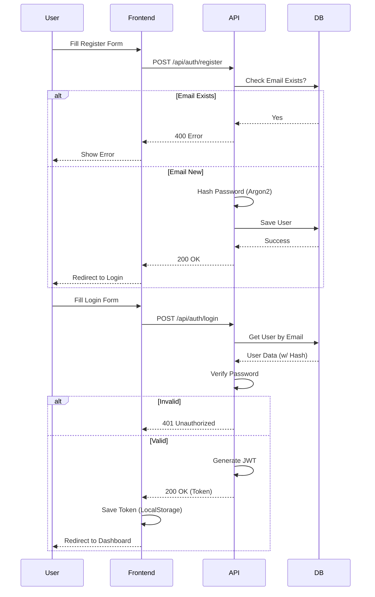

# Authentication Flow Documentation

This document outlines the complete registration and login process for the ECG Live Platform, including frontend interactions, backend processing, and security measures.

## 1. System Overview

The authentication system is built using:
- **Frontend:** Vanilla JavaScript (ES6+) with `fetch` API.
- **Backend:** FastAPI (Python).
- **Database:** PostgreSQL (via SQLAlchemy).
- **Security:** 
  - **Hashing:** Argon2 (via `argon2-cffi` and `passlib`).
  - **Tokens:** JWT (JSON Web Tokens) for session management.

---

## 2. Registration Flow

### A. Frontend (`static/js/modules/auth/AuthController.js`)
1.  **User Action:** User fills out the registration form (Name, Email, Password, Confirm Password).
2.  **Validation:** 
    -   Checks if passwords match.
    -   Frontend prevents submission if fields are empty.
3.  **API Call:** Sends a `POST` request to `/api/auth/register`.
    ```json
    {
      "full_name": "John Doe",
      "email": "john@example.com",
      "password": "secretpassword",
      "role": "user"
    }
    ```
4.  **Response Handling:**
    -   **Success:** Shows success toast, redirects to `/login`.
    -   **Error:** Displays error message (e.g., "Email already registered").

### B. Backend (`app/api/v1/endpoints/auth.py`)
1.  **Route Handler:** `@router.post("/register")` receives the data.
2.  **Schema Validation (`app/schemas/auth.py`):**
    -   Validates email format.
    -   **Security Check:** Ensures password is not longer than 72 bytes (to prevent DoS attacks on hashing).
3.  **Duplicate Check:** Queries database via `UserRepository.get_by_email`.
    -   If user exists -> Returns `400 Bad Request`.
4.  **Hashing:**
    -   Passes the plain password to `app.core.security.get_password_hash`.
    -   Uses **Argon2** algorithm to generate a secure hash.
5.  **Database Storage (`app/repositories/user.py`):**
    -   Creates a new `TbMUser` record.
    -   Stores `email`, `hashed_password` (not plain text), `full_name`, and default `role`.
    -   Commits the transaction.
6.  **Response:** Returns the created user object (excluding password).

---

## 3. Login Flow

### A. Frontend (`static/js/modules/auth/AuthController.js`)
1.  **User Action:** User enters Email and Password.
2.  **API Call:** Sends a `POST` request to `/api/auth/login`.
    ```json
    {
      "email": "john@example.com",
      "password": "secretpassword"
    }
    ```
3.  **Response Handling:**
    -   **Success:**
        -   Receives JSON with `access_token`, `role`, and `user_name`.
        -   Stores token in `localStorage.getItem('ecg_token')`.
        -   Stores user info in `localStorage.getItem('ecg_user')`.
        -   Redirects to Dashboard (`/`).
    -   **Error:** Displays "Incorrect email or password".

### B. Backend (`app/api/v1/endpoints/auth.py`)
1.  **Route Handler:** `@router.post("/login")` receives the credentials.
2.  **User Lookup:** Fetches the user record by email.
3.  **Verification:**
    -   Calls `verify_password(plain_password, hashed_password)`.
    -   Uses `argon2` to verify the provided password against the stored hash.
    -   If invalid -> Returns `401 Unauthorized`.
4.  **Token Generation:**
    -   If valid, creates a JWT Access Token.
    -   **Payload:** Includes `sub` (email), `role`, and `exp` (expiration time, default 24 hours).
    -   Signed using `SECRET_KEY` and `HS256` algorithm.
5.  **Response:** Returns the token and user details.

---

## 4. Session Management

-   **Authenticated Requests:**
    -   The frontend includes the token in the `Authorization` header for subsequent requests:
        `Authorization: Bearer <token>`
-   **Logout:**
    -   Frontend clears `localStorage`.
    -   Redirects user to `/login`.
    -   (Note: JWTs are stateless; server-side invalidation relies on expiration).

## 5. Security Configuration

-   **Algorithm:** `argon2` (Primary), `bcrypt` (Secondary/Legacy support).
-   **Dependencies:** `argon2-cffi`, `passlib`, `python-jose`.
-   **Configuration File:** `app/core/security.py`.

---

## 6. Flow Diagram (Sequence)


