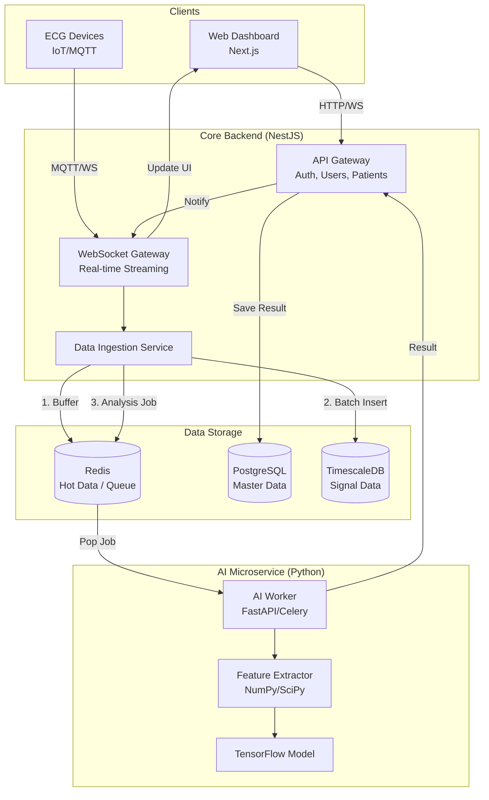
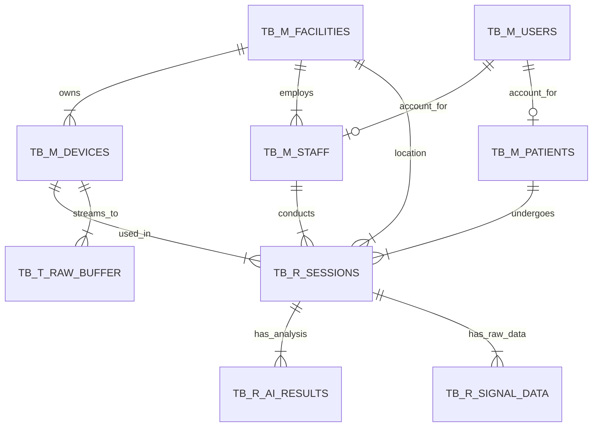

# ECG Monitoring System - Scale Up Design Document

## 1. System Architecture (Hybrid Microservices)

This architecture is designed for National Scale implementation, separating concerns between Real-time Handling, Business Logic, and Heavy AI Processing.



---

## 2. Database Design (ERD)

Using `TB_M_` (Master), `TB_R_` (Transaction), and `TB_T_` (Temporary/Queue) conventions.



---

## 3. Database Schema (PostgreSQL DDL)

### 3.1. Master Tables (`TB_M_`)

```sql
-- Facilities (Puskesmas / RS)
CREATE TABLE tb_m_facilities (
    id              CHAR(26) PRIMARY KEY,       -- TSID
    facility_code   VARCHAR(20) UNIQUE NOT NULL,-- Business Key (ex: PKM-SBY-001)
    name            VARCHAR(100) NOT NULL,
    type            VARCHAR(20) NOT NULL,       -- PUSKESMAS, RSUD, KLINIK
    address         TEXT,
    
    -- Audit Trail
    created_by      CHAR(26) NOT NULL,
    created_dt      TIMESTAMP DEFAULT CURRENT_TIMESTAMP,
    changed_by      CHAR(26),
    changed_dt      TIMESTAMP
);

-- Users (Central Identity)
CREATE TABLE tb_m_users (
    id              CHAR(26) PRIMARY KEY,       -- TSID
    username        VARCHAR(50) UNIQUE NOT NULL,
    email           VARCHAR(100) UNIQUE,
    password_hash   VARCHAR(255) NOT NULL,
    role            VARCHAR(20) NOT NULL,       -- ADMIN, DOCTOR, NURSE, PATIENT
    is_active       BOOLEAN DEFAULT TRUE,
    
    created_by      CHAR(26) NOT NULL,
    created_dt      TIMESTAMP DEFAULT CURRENT_TIMESTAMP,
    changed_by      CHAR(26),
    changed_dt      TIMESTAMP
);

-- Staff (Medical Personnel)
CREATE TABLE tb_m_staff (
    id              CHAR(26) PRIMARY KEY,
    user_id         CHAR(26) UNIQUE NOT NULL REFERENCES tb_m_users(id),
    facility_id     CHAR(26) NOT NULL REFERENCES tb_m_facilities(id),
    
    employee_no     VARCHAR(50) UNIQUE,         -- NIP/SIP (Business Key)
    full_name       VARCHAR(100) NOT NULL,
    specialization  VARCHAR(50),
    
    created_by      CHAR(26) NOT NULL,
    created_dt      TIMESTAMP DEFAULT CURRENT_TIMESTAMP,
    changed_by      CHAR(26),
    changed_dt      TIMESTAMP
);

-- Patients (Medical Data)
CREATE TABLE tb_m_patients (
    id              CHAR(26) PRIMARY KEY,
    user_id         CHAR(26) UNIQUE REFERENCES tb_m_users(id), -- Nullable
    
    -- Format: [FASKES]-[YYYYMM]-[SEQ]
    medical_record_no VARCHAR(50) UNIQUE NOT NULL, 
    nik               VARCHAR(16) UNIQUE,
    
    full_name         VARCHAR(100) NOT NULL,
    date_of_birth     DATE NOT NULL,
    gender            CHAR(1),
    address           TEXT,
    
    created_by      CHAR(26) NOT NULL,
    created_dt      TIMESTAMP DEFAULT CURRENT_TIMESTAMP,
    changed_by      CHAR(26),
    changed_dt      TIMESTAMP
);

-- Devices (IoT Hardware)
CREATE TABLE tb_m_devices (
    id              CHAR(26) PRIMARY KEY,
    serial_number   VARCHAR(50) UNIQUE NOT NULL,
    name            VARCHAR(50),
    facility_id     CHAR(26) REFERENCES tb_m_facilities(id),
    status          VARCHAR(20) DEFAULT 'ACTIVE',
    
    created_by      CHAR(26) NOT NULL,
    created_dt      TIMESTAMP DEFAULT CURRENT_TIMESTAMP,
    changed_by      CHAR(26),
    changed_dt      TIMESTAMP
);
```

### 3.2. Transaction Tables (`TB_R_`)

```sql
-- Sessions (Recording Sessions)
CREATE TABLE tb_r_sessions (
    id              CHAR(26) PRIMARY KEY,
    
    -- Format: [SN]-[YYYYMMDD]-[SEQ]
    session_no      VARCHAR(50) UNIQUE NOT NULL,
    
    facility_id     CHAR(26) NOT NULL REFERENCES tb_m_facilities(id),
    patient_id      CHAR(26) NOT NULL REFERENCES tb_m_patients(id),
    device_id       CHAR(26) NOT NULL REFERENCES tb_m_devices(id),
    staff_id        CHAR(26) NOT NULL REFERENCES tb_m_staff(id),
    
    start_time      TIMESTAMP NOT NULL,
    end_time        TIMESTAMP,
    
    ai_summary      VARCHAR(100), -- Quick snapshot of AI result
    doctor_notes    TEXT,
    
    created_by      CHAR(26) NOT NULL,
    created_dt      TIMESTAMP DEFAULT CURRENT_TIMESTAMP,
    changed_by      CHAR(26),
    changed_dt      TIMESTAMP
);

-- AI Analysis Results (Detail)
CREATE TABLE tb_r_ai_results (
    id              CHAR(26) PRIMARY KEY,
    session_id      CHAR(26) NOT NULL REFERENCES tb_r_sessions(id),
    
    segment_index   INT,
    classification  VARCHAR(50),
    confidence      DECIMAL(5, 4),
    
    features_json   JSONB, -- Store calculated features (RR, PR, QTc) here
    
    created_by      CHAR(26) NOT NULL,
    created_dt      TIMESTAMP DEFAULT CURRENT_TIMESTAMP,
    changed_by      CHAR(26),
    changed_dt      TIMESTAMP
);

-- Signal Data (High Volume - TimescaleDB)
CREATE TABLE tb_r_signal_data (
    time            TIMESTAMPTZ NOT NULL,
    session_id      CHAR(26) NOT NULL,
    lead_i          FLOAT,
    lead_ii         FLOAT,
    lead_v1         FLOAT, -- Assuming 3 leads based on current codebase
    
    created_dt      TIMESTAMP DEFAULT CURRENT_TIMESTAMP
);
-- SELECT create_hypertable('tb_r_signal_data', 'time');
```

### 3.3. Temporary Tables (`TB_T_`)

```sql
-- Raw Ingestion Buffer (High Speed)
CREATE TABLE tb_t_raw_buffer (
    id              BIGSERIAL PRIMARY KEY,
    device_sn       VARCHAR(50) NOT NULL,
    payload_json    JSONB,
    received_at     TIMESTAMP DEFAULT CURRENT_TIMESTAMP,
    is_processed    BOOLEAN DEFAULT FALSE
);

-- AI Job Queue
CREATE TABLE tb_t_ai_jobs (
    id              CHAR(26) PRIMARY KEY,
    session_id      CHAR(26) NOT NULL,
    status          VARCHAR(20) DEFAULT 'PENDING',
    created_dt      TIMESTAMP DEFAULT CURRENT_TIMESTAMP
);
```

## 4. Key Naming Conventions

*   **Primary Keys**: `id` (TSID/ULID, 26 chars)
*   **Foreign Keys**: `[singular_table_name]_id`
*   **Audit Fields**: `created_by`, `created_dt`, `changed_by`, `changed_dt`
*   **Business Keys**: `_no` or `_code` suffix (e.g., `medical_record_no`, `facility_code`)

