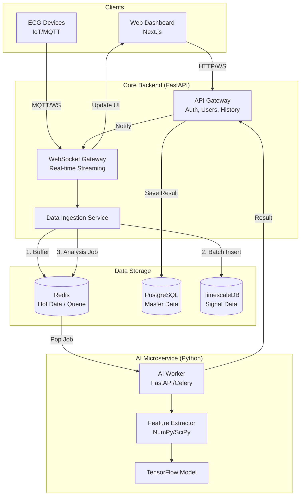
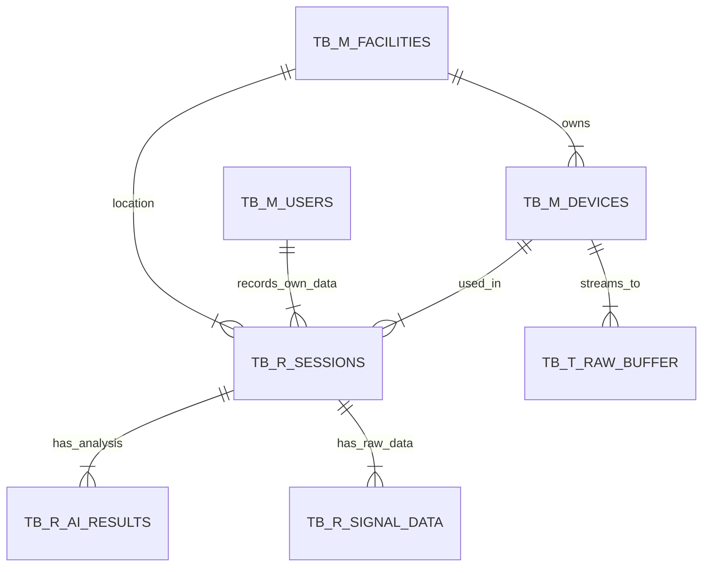

# ECG Monitoring System - Scale Up Design Document

## 1. System Architecture (Hybrid Microservices)

This architecture is designed for National Scale implementation, separating concerns between Real-time Handling, Business Logic, and Heavy AI Processing.



---

## 2. Database Design (ERD)

Using `TB_M_` (Master), `TB_R_` (Transaction), and `TB_T_` (Temporary/Queue) conventions.



---

## 3. Database Schema (PostgreSQL DDL)

### 3.1. Master Tables (`TB_M_`)

```sql
-- Facilities (Puskesmas / RS)
CREATE TABLE tb_m_facilities (
    id              CHAR(26) PRIMARY KEY,       -- TSID
    facility_code   VARCHAR(20) UNIQUE NOT NULL,-- Business Key (ex: PKM-SBY-001)
    name            VARCHAR(100) NOT NULL,
    type            VARCHAR(20) NOT NULL,       -- PUSKESMAS, RSUD, KLINIK
    address         TEXT,
    
    -- Audit Trail
    created_by      CHAR(26) NOT NULL,
    created_dt      TIMESTAMP DEFAULT CURRENT_TIMESTAMP,
    changed_by      CHAR(26),
    changed_dt      TIMESTAMP
);

-- Users (Central Identity & Patient Data)
CREATE TABLE tb_m_user (
    id              SERIAL PRIMARY KEY,
    username        VARCHAR(50) UNIQUE NOT NULL,
    email           VARCHAR(100) UNIQUE NOT NULL,
    hashed_password VARCHAR(255) NOT NULL,
    role            VARCHAR(20) DEFAULT 'user', -- user, operator, doctor, admin
    is_active       INTEGER DEFAULT 1,
    full_name       VARCHAR(100),
    
    -- Patient Profile Fields
    is_patient      BOOLEAN DEFAULT FALSE,      -- Profile Completed Flag
    dob             DATE,
    gender          VARCHAR(10),
    address         VARCHAR(255),
    contact_number  VARCHAR(20),
    medical_history TEXT,
    
    created_by      VARCHAR(50) DEFAULT 'SYSTEM',
    created_dt      TIMESTAMP DEFAULT CURRENT_TIMESTAMP,
    changed_by      VARCHAR(50),
    changed_dt      TIMESTAMP
);

-- Devices (IoT Hardware)
CREATE TABLE tb_m_devices (
    id              CHAR(26) PRIMARY KEY,
    serial_number   VARCHAR(50) UNIQUE NOT NULL,
    name            VARCHAR(50),
    facility_id     CHAR(26) REFERENCES tb_m_facilities(id),
    status          VARCHAR(20) DEFAULT 'ACTIVE',
    
    created_by      CHAR(26) NOT NULL,
    created_dt      TIMESTAMP DEFAULT CURRENT_TIMESTAMP,
    changed_by      CHAR(26),
    changed_dt      TIMESTAMP
);
```

### 3.2. Transaction Tables (`TB_R_`)

```sql
-- Sessions (Recording Sessions)
CREATE TABLE tb_r_ecg_session (
    recording_id    VARCHAR(50) PRIMARY KEY,
    device_id       VARCHAR(50) NOT NULL,
    user_id         INTEGER NOT NULL REFERENCES tb_m_user(id),
    
    classification_result VARCHAR(50) DEFAULT 'Pending',
    confidence_score FLOAT,
    
    avg_bpm         FLOAT,
    avg_rr_ms       FLOAT,
    avg_pr_ms       FLOAT,
    avg_qs_ms       FLOAT,
    avg_qtc_ms      FLOAT,
    avg_st_ms       FLOAT,
    rs_ratio_v1     FLOAT,
    
    -- Audit Trail
    created_by      VARCHAR(50) NOT NULL,
    created_dt      TIMESTAMP DEFAULT CURRENT_TIMESTAMP,
    changed_by      VARCHAR(50),
    changed_dt      TIMESTAMP
);

-- Signal Data
CREATE TABLE tb_r_ecg_raw (
    id              BIGSERIAL PRIMARY KEY,
    recording_id    VARCHAR(50) NOT NULL REFERENCES tb_r_ecg_session(recording_id) ON DELETE CASCADE,
    
    mv_lead_I       FLOAT,
    mv_lead_II      FLOAT,
    mv_v1           FLOAT,
    
    raw_lead_I      INTEGER,
    raw_lead_II     INTEGER,
    raw_v1          INTEGER,
    
    created_by      VARCHAR(50),
    created_dt      TIMESTAMP DEFAULT CURRENT_TIMESTAMP
);
```

### 3.3. Temporary Tables (`TB_T_`)

```sql
-- Raw Ingestion Buffer (High Speed)
CREATE TABLE tb_t_raw_buffer (
    id              BIGSERIAL PRIMARY KEY,
    device_sn       VARCHAR(50) NOT NULL,
    payload_json    JSONB,
    received_at     TIMESTAMP DEFAULT CURRENT_TIMESTAMP,
    is_processed    BOOLEAN DEFAULT FALSE
);
```

## 4. Key Naming Conventions

*   **Primary Keys**: `id` or `[entity]_id`
*   **Audit Fields**: `created_by`, `created_dt`, `changed_by`, `changed_dt`
*   **Business Keys**: `_no` or `_code` suffix
*   **Table Prefixes**: `TB_M_` (Master), `TB_R_` (Transaction), `TB_T_` (Temporary)
