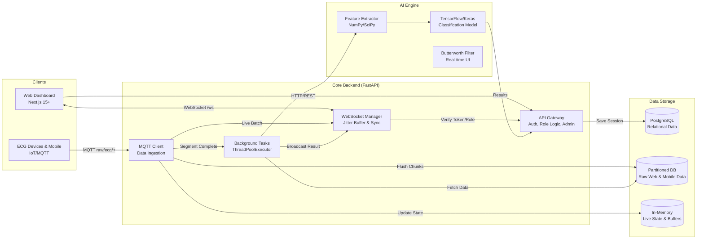
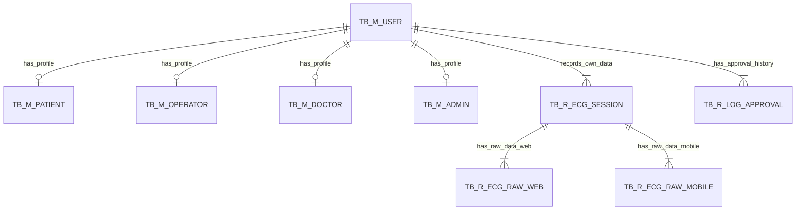

# ECG Monitoring System - Scale Up Design Document

## 1. System Architecture (Hybrid Microservices)

This architecture is designed for National Scale implementation, separating concerns between Real-time Handling, Business Logic, and Heavy AI Processing.



---

## 2. Database Design (ERD)

Using `TB_M_` (Master), `TB_R_` (Transaction), and `TB_T_` (Temporary/Queue) conventions.



---

## 3. Database Schema (PostgreSQL DDL)

### 3.1. Master Tables (`TB_M_`)

```sql
-- Users (Central Identity & Authentication)
CREATE TABLE tb_m_user (
    id              VARCHAR(30) PRIMARY KEY,    -- USR + YYYYMMDD + 6-digit seq
    username        VARCHAR(50) UNIQUE NOT NULL,
    email           VARCHAR(100) UNIQUE NOT NULL,
    hashed_password VARCHAR(255) NOT NULL,
    role            VARCHAR(20) DEFAULT 'user', -- user, operator, doctor, admin
    is_active       INTEGER DEFAULT 1,          -- 1: Active, 0: Inactive
    is_activated    INTEGER DEFAULT 0,          -- 1: Approved, 0: Pending/Rejected
    is_patient      BOOLEAN DEFAULT FALSE,
    is_operator     BOOLEAN DEFAULT FALSE,
    is_doctor       BOOLEAN DEFAULT FALSE,
    current_session_id VARCHAR(100),            -- For "Last Login Wins"
    last_login_dt   TIMESTAMP,
    last_login_source VARCHAR(50),              -- WEB, MOBILE
    
    created_by      VARCHAR(50) DEFAULT 'SYSTEM',
    created_dt      TIMESTAMP DEFAULT CURRENT_TIMESTAMP,
    changed_by      VARCHAR(50),
    changed_dt      TIMESTAMP
);

-- Patients (Clinical Profiles)
CREATE TABLE tb_m_patient (
    id              VARCHAR(30) PRIMARY KEY,    -- PAT + YYYYMMDD + seq
    user_id         VARCHAR(30) UNIQUE NOT NULL REFERENCES tb_m_user(id) ON DELETE CASCADE,
    
    nik             VARCHAR(20) UNIQUE,
    full_name       VARCHAR(100) NOT NULL,
    pob             VARCHAR(100) NOT NULL,
    dob             DATE NOT NULL,
    gender          VARCHAR(10) NOT NULL,       -- L/P
    address         VARCHAR(255),
    contact_number  VARCHAR(20),
    medical_history TEXT,
    status          VARCHAR(20) DEFAULT 'QUEUE',-- QUEUE, APPROVED, REJECTED
    
    created_by      VARCHAR(50) DEFAULT 'SYSTEM',
    created_dt      TIMESTAMP DEFAULT CURRENT_TIMESTAMP,
    changed_by      VARCHAR(50),
    changed_dt      TIMESTAMP
);

-- Operators (Nurses / GP)
CREATE TABLE tb_m_operator (
    id              VARCHAR(30) PRIMARY KEY,    -- OPR + YYYYMMDD + seq
    user_id         VARCHAR(30) UNIQUE NOT NULL REFERENCES tb_m_user(id) ON DELETE CASCADE,
    
    nik             VARCHAR(20) UNIQUE,
    full_name       VARCHAR(100) NOT NULL,
    pob             VARCHAR(100) NOT NULL,
    dob             DATE NOT NULL,
    gender          VARCHAR(10) NOT NULL,
    address         VARCHAR(255),
    contact_number  VARCHAR(20),
    str_number      VARCHAR(50) NOT NULL,       -- Surat Tanda Registrasi
    operator_role   VARCHAR(50) NOT NULL,       -- Nurse or General Practitioner
    work_location   VARCHAR(100),
    status          VARCHAR(20) DEFAULT 'QUEUE',
    
    created_by      VARCHAR(50) DEFAULT 'SYSTEM',
    created_dt      TIMESTAMP DEFAULT CURRENT_TIMESTAMP,
    changed_by      VARCHAR(50),
    changed_dt      TIMESTAMP
);

-- Doctors (Specialists)
CREATE TABLE tb_m_doctor (
    id              VARCHAR(30) PRIMARY KEY,    -- DOC + YYYYMMDD + seq
    user_id         VARCHAR(30) UNIQUE NOT NULL REFERENCES tb_m_user(id) ON DELETE CASCADE,
    
    nik             VARCHAR(20) UNIQUE,
    full_name       VARCHAR(100) NOT NULL,
    pob             VARCHAR(100) NOT NULL,
    dob             DATE NOT NULL,
    gender          VARCHAR(10) NOT NULL,
    address         VARCHAR(255),
    contact_number  VARCHAR(20),
    str_number      VARCHAR(50) NOT NULL,
    sip_number      VARCHAR(50) NOT NULL,       -- Surat Izin Praktik
    specialty       VARCHAR(100) NOT NULL,
    work_location   VARCHAR(100),
    status          VARCHAR(20) DEFAULT 'QUEUE',
    
    created_by      VARCHAR(50) DEFAULT 'SYSTEM',
    created_dt      TIMESTAMP DEFAULT CURRENT_TIMESTAMP,
    changed_by      VARCHAR(50),
    changed_dt      TIMESTAMP
);

-- Administrators
CREATE TABLE tb_m_admin (
    id              VARCHAR(30) PRIMARY KEY,    -- ADM + YYYYMMDD + seq
    user_id         VARCHAR(30) UNIQUE NOT NULL REFERENCES tb_m_user(id) ON DELETE CASCADE,
    
    nik             VARCHAR(20) UNIQUE,
    full_name       VARCHAR(100) NOT NULL,
    pob             VARCHAR(100) NOT NULL,
    dob             DATE NOT NULL,
    gender          VARCHAR(10) NOT NULL,
    address         VARCHAR(255) NOT NULL,
    contact_number  VARCHAR(20) NOT NULL,
    status          VARCHAR(20) DEFAULT 'QUEUE',
    
    created_by      VARCHAR(50) DEFAULT 'SYSTEM',
    created_dt      TIMESTAMP DEFAULT CURRENT_TIMESTAMP,
    changed_by      VARCHAR(50),
    changed_dt      TIMESTAMP
);
```

### 3.2. Transaction Tables (`TB_R_`)

```sql
-- Profile Approval Logs
CREATE TABLE tb_r_log_approval (
    id              VARCHAR(30) PRIMARY KEY,    -- APP + YYYYMMDD + seq
    user_id         VARCHAR(30) NOT NULL REFERENCES tb_m_user(id) ON DELETE CASCADE,
    status          VARCHAR(20) NOT NULL,       -- QUEUE, APPROVED, REJECTED
    reason          VARCHAR(100),               -- Reason for rejection or approval notes
    
    created_by      VARCHAR(50) DEFAULT 'SYSTEM',
    created_dt      TIMESTAMP DEFAULT CURRENT_TIMESTAMP
);

-- Sessions (Recording Sessions)
CREATE TABLE tb_r_ecg_session (
    recording_id    VARCHAR(50) PRIMARY KEY,    -- UUID
    device_id       VARCHAR(50) NOT NULL,       -- ID of the device used
    user_id         VARCHAR(30) NOT NULL REFERENCES tb_m_user(id),
    
    classification_result VARCHAR(50) DEFAULT 'Pending',
    confidence_score FLOAT,
    
    avg_bpm         FLOAT,
    avg_rr_ms       FLOAT,
    avg_pr_ms       FLOAT,
    avg_qs_ms       FLOAT,
    avg_qtc_ms      FLOAT,
    avg_st_ms       FLOAT,
    rs_ratio_v1     FLOAT,
    
    -- Audit Trail
    created_by      VARCHAR(50) NOT NULL,       -- e.g., WEB, ADMIN, MOBILE
    created_dt      TIMESTAMP DEFAULT CURRENT_TIMESTAMP,
    changed_by      VARCHAR(50),
    changed_dt      TIMESTAMP
);

-- Signal Data (Web/Desktop)
CREATE TABLE tb_r_ecg_raw_web (
    id              BIGSERIAL PRIMARY KEY,
    recording_id    VARCHAR(50) NOT NULL REFERENCES tb_r_ecg_session(recording_id) ON DELETE CASCADE,
    
    mv_lead_I       FLOAT,
    mv_lead_II      FLOAT,
    mv_lead_III     FLOAT,
    mv_avF          FLOAT,
    mv_v1           FLOAT,
    
    raw_lead_I      INTEGER,
    raw_lead_II     INTEGER,
    raw_v1          INTEGER,
    
    created_by      VARCHAR(50) DEFAULT 'DEVICE',
    created_dt      TIMESTAMP DEFAULT CURRENT_TIMESTAMP
);

-- Signal Data (Mobile)
CREATE TABLE tb_r_ecg_raw_mobile (
    id              BIGSERIAL PRIMARY KEY,
    recording_id    VARCHAR(50) NOT NULL REFERENCES tb_r_ecg_session(recording_id) ON DELETE CASCADE,
    
    mv_lead_I       FLOAT,
    mv_lead_II      FLOAT,
    mv_lead_III     FLOAT,
    mv_avF          FLOAT,
    mv_v1           FLOAT,
    
    raw_lead_I      INTEGER,
    raw_lead_II     INTEGER,
    raw_v1          INTEGER,
    
    created_by      VARCHAR(50) DEFAULT 'MOBILE',
    created_dt      TIMESTAMP DEFAULT CURRENT_TIMESTAMP
);
```

## 4. Key Naming Conventions

*   **Primary Keys**: `id` or `[entity]_id`
*   **Audit Fields**: `created_by`, `created_dt`, `changed_by`, `changed_dt`
*   **Business Keys**: Prefix + YYYYMMDD + 6-digit seq (e.g., `USR20240101000001`, `PAT...`, `DOC...`, `OPR...`, `ADM...`) or UUID (`recording_id`)
*   **Table Prefixes**: `tb_m_` (Master), `tb_r_` (Transaction)

## 5. Indexing & Optimization Strategies

To maintain high performance during national-scale telemetry ingestion, the following indexing strategies are applied:

1.  **Composite Time-Series Indexes**:
    *   `idx_raw_web_recording_dt` on `tb_r_ecg_raw_web(recording_id, created_dt)`: Optimized for sequential signal retrieval and plotting.
    *   `idx_raw_mobile_recording_dt` on `tb_r_ecg_raw_mobile(recording_id, created_dt)`: Optimized for mobile platform signal retrieval.

2.  **Lookup & Relationship Indexes**:
    *   `unique_user_sid`: Enforces single-session logic on `tb_m_user(current_session_id)`.
    *   `idx_patient_user` / `idx_doctor_user` / `idx_operator_user` / `idx_admin_user`: Linked indexes between authentication and specific clinical profiles.
    *   `idx_session_recording`: Primary identifier for recording sessions and AI classification results.

3.  **Audit & Lifecycle Indexes**:
    *   All tables include indexes on `created_dt` and `changed_dt` to support administrative reporting and automated cleanup workers.
