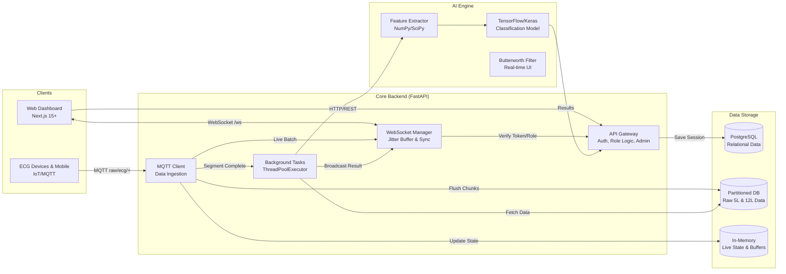
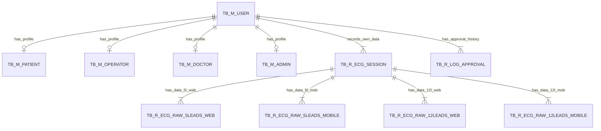

# ECG Monitoring System - Scale Up Design Document

## 1. System Architecture (Hybrid Microservices)

This architecture is designed for National Scale implementation, separating concerns between Real-time Handling, Business Logic, and Heavy AI Processing.



---

## 2. Database Design (ERD)

Using `TB_M_` (Master), `TB_R_` (Transaction), and `TB_T_` (Temporary/Queue) conventions.



---

## 3. Database Schema (PostgreSQL DDL)

### 3.1. Master Tables (`TB_M_`)

```sql
-- Users (Central Identity & Authentication)
CREATE TABLE tb_m_user (
    id              VARCHAR(30) PRIMARY KEY,    -- USR + YYYYMMDD + 6-digit seq
    username        VARCHAR(50) UNIQUE NOT NULL,
    email           VARCHAR(100) UNIQUE NOT NULL,
    hashed_password VARCHAR(255) NOT NULL,
    role            VARCHAR(20) DEFAULT 'user', -- user, operator, doctor, admin
    is_active       INTEGER DEFAULT 1,          -- 1: Active, 0: Inactive
    is_activated    INTEGER DEFAULT 0,          -- 1: Approved, 0: Pending/Rejected
    is_patient      BOOLEAN DEFAULT FALSE,
    is_operator     BOOLEAN DEFAULT FALSE,
    is_doctor       BOOLEAN DEFAULT FALSE,
    current_session_id VARCHAR(100),            -- For "Last Login Wins"
    last_login_dt   TIMESTAMP,
    last_login_source VARCHAR(50),              -- WEB, MOBILE
    
    created_by      VARCHAR(50) DEFAULT 'SYSTEM',
    created_dt      TIMESTAMP DEFAULT CURRENT_TIMESTAMP,
    changed_by      VARCHAR(50),
    changed_dt      TIMESTAMP
);

-- Patients (Clinical Profiles)
CREATE TABLE tb_m_patient (
    id              VARCHAR(30) PRIMARY KEY,
    user_id         VARCHAR(30) UNIQUE NOT NULL REFERENCES tb_m_user(id) ON DELETE CASCADE,
    nik             VARCHAR(20) UNIQUE,
    full_name       VARCHAR(100) NOT NULL,
    pob             VARCHAR(100) NOT NULL,
    dob             DATE NOT NULL,
    gender          VARCHAR(10) NOT NULL,
    address         VARCHAR(255),
    contact_number  VARCHAR(20),
    medical_history TEXT,
    status          VARCHAR(20) DEFAULT 'QUEUE',
    created_by      VARCHAR(50),
    created_dt      TIMESTAMP,
    changed_by      VARCHAR(50),
    changed_dt      TIMESTAMP
);

-- Operators (Nurses / GP)
CREATE TABLE tb_m_operator (
    id              VARCHAR(30) PRIMARY KEY,
    user_id         VARCHAR(30) UNIQUE NOT NULL REFERENCES tb_m_user(id) ON DELETE CASCADE,
    nik             VARCHAR(20) UNIQUE,
    full_name       VARCHAR(100) NOT NULL,
    str_number      VARCHAR(50) NOT NULL,
    operator_role   VARCHAR(50) NOT NULL,
    work_location   VARCHAR(100),
    status          VARCHAR(20) DEFAULT 'QUEUE',
    created_by      VARCHAR(50),
    created_dt      TIMESTAMP,
    changed_by      VARCHAR(50),
    changed_dt      TIMESTAMP
);

-- Doctors (Specialists)
CREATE TABLE tb_m_doctor (
    id              VARCHAR(30) PRIMARY KEY,
    user_id         VARCHAR(30) UNIQUE NOT NULL REFERENCES tb_m_user(id) ON DELETE CASCADE,
    nik             VARCHAR(20) UNIQUE,
    full_name       VARCHAR(100) NOT NULL,
    str_number      VARCHAR(50) NOT NULL,
    sip_number      VARCHAR(50) NOT NULL,
    specialty       VARCHAR(100) NOT NULL,
    work_location   VARCHAR(100),
    status          VARCHAR(20) DEFAULT 'QUEUE',
    created_by      VARCHAR(50),
    created_dt      TIMESTAMP,
    changed_by      VARCHAR(50),
    changed_dt      TIMESTAMP
);
```

### 3.2. Transaction Tables (`TB_R_`)

```sql
-- Profile Approval Logs
CREATE TABLE tb_r_log_approval (
    id              VARCHAR(30) PRIMARY KEY,
    user_id         VARCHAR(30) NOT NULL REFERENCES tb_m_user(id) ON DELETE CASCADE,
    status          VARCHAR(20) NOT NULL,
    reason          VARCHAR(100),
    created_by      VARCHAR(50),
    created_dt      TIMESTAMP DEFAULT CURRENT_TIMESTAMP
);

-- Sessions (Recording Sessions)
CREATE TABLE tb_r_ecg_session (
    recording_id    VARCHAR(50) PRIMARY KEY,    -- UUID
    device_id       VARCHAR(50) NOT NULL,
    user_id         VARCHAR(30) NOT NULL REFERENCES tb_m_user(id),
    device_type     VARCHAR(20),                -- 5LEADS, 12LEADS
    classification_result VARCHAR(50) DEFAULT 'Pending',
    confidence_score FLOAT,
    avg_bpm         FLOAT,
    avg_rr_ms       FLOAT,
    avg_pr_ms       FLOAT,
    avg_qs_ms       FLOAT,
    avg_qtc_ms      FLOAT,
    avg_st_ms       FLOAT,
    rs_ratio_v1     FLOAT,
    created_by      VARCHAR(50),
    created_dt      TIMESTAMP DEFAULT CURRENT_TIMESTAMP,
    changed_by      VARCHAR(50),
    changed_dt      TIMESTAMP
);

-- Signal Data 5-Leads (Web)
CREATE TABLE tb_r_ecg_raw_5leads_web (
    id              BIGSERIAL PRIMARY KEY,
    recording_id    VARCHAR(50) NOT NULL REFERENCES tb_r_ecg_session(recording_id) ON DELETE CASCADE,
    created_dt      TIMESTAMP WITH TIME ZONE,
    created_by      VARCHAR(50),
    mv_lead_i       FLOAT,
    mv_lead_ii      FLOAT,
    mv_lead_iii     FLOAT,
    mv_avf          FLOAT,
    mv_v1           FLOAT,
    raw_lead_i      INTEGER,
    raw_lead_ii     INTEGER,
    raw_v1          INTEGER
);

-- Signal Data 5-Leads (Mobile)
CREATE TABLE tb_r_ecg_raw_5leads_mobile (
    id              BIGSERIAL PRIMARY KEY,
    recording_id    VARCHAR(50) NOT NULL REFERENCES tb_r_ecg_session(recording_id) ON DELETE CASCADE,
    created_dt      TIMESTAMP WITH TIME ZONE,
    created_by      VARCHAR(50),
    mv_lead_i       FLOAT,
    mv_lead_ii      FLOAT,
    mv_lead_iii     FLOAT,
    mv_avf          FLOAT,
    mv_v1           FLOAT,
    raw_lead_i      INTEGER,
    raw_lead_ii     INTEGER,
    raw_v1          INTEGER
);

-- Signal Data 12-Leads (Web)
CREATE TABLE tb_r_ecg_raw_12leads_web (
    id              BIGSERIAL PRIMARY KEY,
    recording_id    VARCHAR(50) NOT NULL REFERENCES tb_r_ecg_session(recording_id) ON DELETE CASCADE,
    created_dt      TIMESTAMP WITH TIME ZONE,
    created_by      VARCHAR(50),
    mv_lead_i       FLOAT, mv_lead_ii FLOAT, mv_lead_iii FLOAT,
    mv_avr FLOAT, mv_avl FLOAT, mv_avf FLOAT,
    mv_v1 FLOAT, mv_v2 FLOAT, mv_v3 FLOAT, mv_v4 FLOAT, mv_v5 FLOAT, mv_v6 FLOAT,
    raw_lead_i INTEGER, raw_lead_ii INTEGER, raw_lead_iii INTEGER,
    raw_avr INTEGER, raw_avl INTEGER, raw_avf INTEGER,
    raw_v1 INTEGER, raw_v2 INTEGER, raw_v3 INTEGER, raw_v4 INTEGER, raw_v5 INTEGER, raw_v6 INTEGER
);

-- Signal Data 12-Leads (Mobile)
CREATE TABLE tb_r_ecg_raw_12leads_mobile (
    id              BIGSERIAL PRIMARY KEY,
    recording_id    VARCHAR(50) NOT NULL REFERENCES tb_r_ecg_session(recording_id) ON DELETE CASCADE,
    created_dt      TIMESTAMP WITH TIME ZONE,
    created_by      VARCHAR(50),
    mv_lead_i       FLOAT, mv_lead_ii FLOAT, mv_lead_iii FLOAT,
    mv_avr FLOAT, mv_avl FLOAT, mv_avf FLOAT,
    mv_v1 FLOAT, mv_v2 FLOAT, mv_v3 FLOAT, mv_v4 FLOAT, mv_v5 FLOAT, mv_v6 FLOAT,
    raw_lead_i INTEGER, raw_lead_ii INTEGER, raw_lead_iii INTEGER,
    raw_avr INTEGER, raw_avl INTEGER, raw_avf INTEGER,
    raw_v1 INTEGER, raw_v2 INTEGER, raw_v3 INTEGER, raw_v4 INTEGER, raw_v5 INTEGER, raw_v6 INTEGER
);
```

## 4. Key Naming Conventions

*   **Primary Keys**: `id` or `[entity]_id`
*   **Audit Fields**: `created_by`, `created_dt`, `changed_by`, `changed_dt`
*   **Business Keys**: Prefix + YYYYMMDD + 6-digit seq (e.g., `USR20240101000001`)
*   **Table Prefixes**: `tb_m_` (Master), `tb_r_` (Transaction)

## 5. Indexing & Optimization Strategies

1.  **Composite Time-Series Indexes**: `(recording_id, created_dt)` on all raw data tables for sequential signal retrieval.
2.  **Lookup & Relationship Indexes**: Linked indexes between authentication and specific clinical profiles.
3.  **Audit & Lifecycle Indexes**: Indexes on `created_dt` and `changed_dt` to support reporting and automated cleanup workers.
