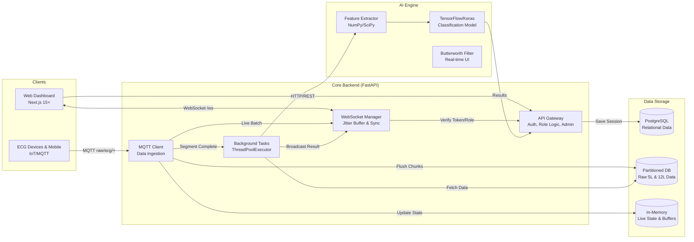
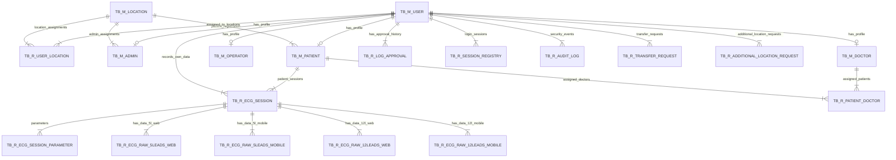

# ECG Monitoring System - Scale Up Design Document

## 1. System Architecture (Hybrid Microservices)

This architecture is designed for National Scale implementation, separating concerns between Real-time Handling, Business Logic, and Heavy AI Processing.



---

## 2. Database Design (ERD)

Using `TB_M_` (Master), `TB_R_` (Transaction), and `TB_T_` (Temporary/Queue) conventions.



---

### Notes
- `tb_m_location.is_active` tracks location lifecycle (Boolean for activate/deactivate).
- `tb_r_user_location.is_primary` distinguishes primary vs. secondary locations for staff assigned to multiple clinics.
- `tb_r_patient_doctor.is_active` acts as a soft-delete flag to maintain historical assignment audit trails.
- `tb_m_user.full_name` is now populated directly on the central user table, acting as a fallback when profile data isn't loaded.
- `tb_m_patient.user_id` is nullable to support operator-created walk-in patients (a patient may not have a linked `tb_m_user`).
- `tb_m_patient.operator_id` and `tb_m_patient.location_id` are populated for walk-in patients to restrict visibility to the originating operator/clinic.
- `tb_r_ecg_session.user_id` and `tb_r_ecg_session.patient_id` are nullable — a session can reference either a registered user or a walk-in patient.
- `tb_r_ecg_session_parameter` enforces a unique constraint on `(recording_id, lead_name)`.
- `tb_m_user.must_reset_password` (0/1) exists to force password change on first login or after operator-created conversion.

---

## 3. Database Schema (PostgreSQL DDL)

### 3.1. Master Tables (`TB_M_`)

```sql
-- Locations (Puskesmas / Clinics)
CREATE TABLE tb_m_location (
    id              VARCHAR(30) PRIMARY KEY,
    name            VARCHAR(100) NOT NULL,
    address         VARCHAR(255),
    contact_number  VARCHAR(20),
    is_active       BOOLEAN DEFAULT TRUE,
    created_by      VARCHAR(50) DEFAULT 'SYSTEM',
    created_dt      TIMESTAMP WITH TIME ZONE DEFAULT now(),
    changed_by      VARCHAR(50),
    changed_dt      TIMESTAMP WITH TIME ZONE
);

-- Users (Central Identity & Authentication)
CREATE TABLE tb_m_user (
    id              VARCHAR(30) PRIMARY KEY,
    username        VARCHAR(50) UNIQUE NOT NULL,
    email           VARCHAR(100) UNIQUE NOT NULL,
    hashed_password VARCHAR(255) NOT NULL,
    full_name       VARCHAR(100),
    role            VARCHAR(20) DEFAULT 'user',
    is_active       INTEGER DEFAULT 1,
    is_activated    INTEGER DEFAULT 0,
    is_patient      BOOLEAN DEFAULT FALSE,
    is_operator     BOOLEAN DEFAULT FALSE,
    is_doctor       BOOLEAN DEFAULT FALSE,
    must_reset_password INTEGER DEFAULT 0,
    location_id     VARCHAR(30) REFERENCES tb_m_location(id),
    last_login_dt   TIMESTAMP WITH TIME ZONE,
    last_login_source VARCHAR(50),
    current_session_id VARCHAR(100),
    created_by      VARCHAR(50) DEFAULT 'SYSTEM',
    created_dt      TIMESTAMP WITH TIME ZONE DEFAULT now(),
    changed_by      VARCHAR(50),
    changed_dt      TIMESTAMP WITH TIME ZONE
);

-- Admins (Location Administrators)
CREATE TABLE tb_m_admin (
    id              VARCHAR(30) PRIMARY KEY,
    user_id         VARCHAR(30) UNIQUE NOT NULL REFERENCES tb_m_user(id) ON DELETE CASCADE,
    location_id     VARCHAR(30) NOT NULL REFERENCES tb_m_location(id),
    full_name       VARCHAR(100) NOT NULL,
    nik             VARCHAR(20) UNIQUE,
    pob             VARCHAR(100),
    dob             DATE,
    gender          VARCHAR(10),
    address         VARCHAR(255),
    contact_number  VARCHAR(20),
    status          VARCHAR(20) DEFAULT 'APPROVED',
    created_by      VARCHAR(50) DEFAULT 'SYSTEM',
    created_dt      TIMESTAMP WITH TIME ZONE DEFAULT now(),
    changed_by      VARCHAR(50),
    changed_dt      TIMESTAMP WITH TIME ZONE
);

-- Patients (Clinical Profiles)
CREATE TABLE tb_m_patient (
    id              VARCHAR(30) PRIMARY KEY,
    user_id         VARCHAR(30) REFERENCES tb_m_user(id) ON DELETE CASCADE,
    operator_id     VARCHAR(30) REFERENCES tb_m_user(id),
    location_id     VARCHAR(30) REFERENCES tb_m_location(id),
    full_name       VARCHAR(100) NOT NULL,
    nik             VARCHAR(20) UNIQUE,
    pob             VARCHAR(100) NOT NULL,
    dob             DATE NOT NULL,
    gender          VARCHAR(10) NOT NULL,
    address         VARCHAR(255),
    contact_number  VARCHAR(20),
    medical_history TEXT,
    status          VARCHAR(20) DEFAULT 'QUEUE',
    is_locked       BOOLEAN DEFAULT FALSE,
    locked_by       VARCHAR(30) REFERENCES tb_m_user(id),
    locked_at       TIMESTAMP WITH TIME ZONE,
    created_by      VARCHAR(50) DEFAULT 'SYSTEM',
    created_dt      TIMESTAMP WITH TIME ZONE DEFAULT now(),
    changed_by      VARCHAR(50),
    changed_dt      TIMESTAMP WITH TIME ZONE
);

-- Operators (Nurses / GP)
CREATE TABLE tb_m_operator (
    id              VARCHAR(30) PRIMARY KEY,
    user_id         VARCHAR(30) UNIQUE NOT NULL REFERENCES tb_m_user(id) ON DELETE CASCADE,
    location_id     VARCHAR(30) REFERENCES tb_m_location(id),
    full_name       VARCHAR(100) NOT NULL,
    nik             VARCHAR(20) UNIQUE,
    pob             VARCHAR(100) NOT NULL,
    dob             DATE NOT NULL,
    gender          VARCHAR(10) NOT NULL,
    address         VARCHAR(255),
    contact_number  VARCHAR(20),
    str_number      VARCHAR(50) NOT NULL,
    operator_role   VARCHAR(50) NOT NULL,
    status          VARCHAR(20) DEFAULT 'QUEUE',
    created_by      VARCHAR(50) DEFAULT 'SYSTEM',
    created_dt      TIMESTAMP WITH TIME ZONE DEFAULT now(),
    changed_by      VARCHAR(50),
    changed_dt      TIMESTAMP WITH TIME ZONE
);

-- Doctors (Specialists)
CREATE TABLE tb_m_doctor (
    id              VARCHAR(30) PRIMARY KEY,
    user_id         VARCHAR(30) UNIQUE NOT NULL REFERENCES tb_m_user(id) ON DELETE CASCADE,
    location_id     VARCHAR(30) REFERENCES tb_m_location(id),
    full_name       VARCHAR(100) NOT NULL,
    nik             VARCHAR(20) UNIQUE,
    pob             VARCHAR(100) NOT NULL,
    dob             DATE NOT NULL,
    gender          VARCHAR(10) NOT NULL,
    address         VARCHAR(255),
    contact_number  VARCHAR(20),
    str_number      VARCHAR(50) NOT NULL,
    sip_number      VARCHAR(50) NOT NULL,
    specialty       VARCHAR(100) NOT NULL,
    status          VARCHAR(20) DEFAULT 'QUEUE',
    created_by      VARCHAR(50) DEFAULT 'SYSTEM',
    created_dt      TIMESTAMP WITH TIME ZONE DEFAULT now(),
    changed_by      VARCHAR(50),
    changed_dt      TIMESTAMP WITH TIME ZONE
);
```

### 3.2. Transaction Tables (`TB_R_`)

```sql
-- Staff Location Assignments
CREATE TABLE tb_r_user_location (
    id VARCHAR(30) PRIMARY KEY,
    user_id VARCHAR(30) NOT NULL REFERENCES tb_m_user(id) ON DELETE CASCADE,
    location_id VARCHAR(30) NOT NULL REFERENCES tb_m_location(id) ON DELETE CASCADE,
    is_primary BOOLEAN DEFAULT FALSE,
    assigned_by VARCHAR(30) REFERENCES tb_m_user(id),
    created_dt TIMESTAMP WITH TIME ZONE DEFAULT now() NOT NULL,
    created_by VARCHAR(50) DEFAULT 'SYSTEM' NOT NULL,
    UNIQUE(user_id, location_id)
);

-- Patient-Doctor Assignments
CREATE TABLE tb_r_patient_doctor (
    id VARCHAR(30) PRIMARY KEY,
    patient_id VARCHAR(30) NOT NULL REFERENCES tb_m_user(id) ON DELETE CASCADE,
    doctor_id VARCHAR(30) NOT NULL REFERENCES tb_m_user(id) ON DELETE CASCADE,
    location_id VARCHAR(30) NOT NULL REFERENCES tb_m_location(id),
    is_active BOOLEAN DEFAULT TRUE,
    assigned_by VARCHAR(30) REFERENCES tb_m_user(id),
    created_dt TIMESTAMP WITH TIME ZONE DEFAULT now() NOT NULL,
    created_by VARCHAR(50) DEFAULT 'SYSTEM' NOT NULL
);

-- Transfer Requests
CREATE TABLE tb_r_transfer_request (
    id VARCHAR(30) PRIMARY KEY,
    user_id VARCHAR(30) NOT NULL REFERENCES tb_m_user(id) ON DELETE CASCADE,
    source_location_id VARCHAR(30) NOT NULL REFERENCES tb_m_location(id),
    destination_location_id VARCHAR(30) NOT NULL REFERENCES tb_m_location(id),
    requested_by VARCHAR(30) REFERENCES tb_m_user(id),
    status VARCHAR(20) DEFAULT 'PENDING',
    reason TEXT,
    rejection_reason TEXT,
    processed_by VARCHAR(30) REFERENCES tb_m_user(id),
    processed_dt TIMESTAMP WITH TIME ZONE,
    created_dt TIMESTAMP WITH TIME ZONE DEFAULT now() NOT NULL,
    created_by VARCHAR(50) DEFAULT 'SYSTEM' NOT NULL
);

-- Additional Location Requests
CREATE TABLE tb_r_additional_location_request (
    id VARCHAR(30) PRIMARY KEY,
    user_id VARCHAR(30) NOT NULL REFERENCES tb_m_user(id) ON DELETE CASCADE,
    location_id VARCHAR(30) NOT NULL REFERENCES tb_m_location(id),
    requested_by VARCHAR(30) REFERENCES tb_m_user(id),
    status VARCHAR(20) DEFAULT 'PENDING',
    reason TEXT,
    rejection_reason TEXT,
    processed_by VARCHAR(30) REFERENCES tb_m_user(id),
    processed_dt TIMESTAMP WITH TIME ZONE,
    created_dt TIMESTAMP WITH TIME ZONE DEFAULT now() NOT NULL,
    created_by VARCHAR(50) DEFAULT 'SYSTEM' NOT NULL
);

-- Session Registry (JWT Tracking)
CREATE TABLE tb_r_session_registry (
    id VARCHAR(36) PRIMARY KEY,
    user_id VARCHAR(30) NOT NULL REFERENCES tb_m_user(id) ON DELETE CASCADE,
    session_id VARCHAR(100) UNIQUE NOT NULL,
    ip_address VARCHAR(45),
    user_agent TEXT,
    is_valid BOOLEAN DEFAULT TRUE,
    expires_at TIMESTAMP WITH TIME ZONE NOT NULL,
    created_dt TIMESTAMP WITH TIME ZONE DEFAULT now() NOT NULL,
    created_by VARCHAR(50) DEFAULT 'SYSTEM' NOT NULL
);

-- Audit Log
CREATE TABLE tb_r_audit_log (
    id VARCHAR(36) PRIMARY KEY,
    event_type VARCHAR(50) NOT NULL,
    user_id VARCHAR(30) REFERENCES tb_m_user(id),
    actor_id VARCHAR(30),
    actor_role VARCHAR(50),
    location_id VARCHAR(30) REFERENCES tb_m_location(id),
    details JSONB,
    ip_address VARCHAR(45),
    user_agent TEXT,
    severity VARCHAR(20) DEFAULT 'INFO',
    created_dt TIMESTAMP WITH TIME ZONE DEFAULT now() NOT NULL,
    created_by VARCHAR(50) DEFAULT 'SYSTEM' NOT NULL
);

-- Profile Approval Logs
CREATE TABLE tb_r_log_approval (
    id VARCHAR(30) PRIMARY KEY,
    user_id VARCHAR(30) NOT NULL REFERENCES tb_m_user(id) ON DELETE CASCADE,
    status VARCHAR(20) NOT NULL,
    reason VARCHAR(100),
    created_dt TIMESTAMP WITH TIME ZONE DEFAULT now() NOT NULL,
    created_by VARCHAR(50) DEFAULT 'SYSTEM' NOT NULL
);

-- Sessions (Recording Sessions)
CREATE TABLE tb_r_ecg_session (
    recording_id VARCHAR(50) PRIMARY KEY,
    user_id VARCHAR(36) REFERENCES tb_m_user(id) ON DELETE CASCADE,
    patient_id VARCHAR(50) REFERENCES tb_m_patient(id) ON DELETE CASCADE,
    device_id VARCHAR(50),
    device_type VARCHAR(20),
    classification_result VARCHAR(50) DEFAULT 'Pending',
    is_normal BOOLEAN,
    confidence_score FLOAT,
    created_dt TIMESTAMP WITH TIME ZONE DEFAULT now(),
    created_by VARCHAR(50) DEFAULT 'SYSTEM',
    changed_dt TIMESTAMP WITH TIME ZONE,
    changed_by VARCHAR(50)
);

-- Session parameters
CREATE TABLE tb_r_ecg_session_parameter (
    id SERIAL PRIMARY KEY,
    recording_id VARCHAR(50) NOT NULL REFERENCES tb_r_ecg_session(recording_id),
    lead_name VARCHAR(20) NOT NULL,
    heart_rate_bpm FLOAT,
    rr_ms FLOAT,
    rr_std_ms FLOAT,
    pr_ms FLOAT,
    qrs_ms FLOAT,
    qtc_ms FLOAT,
    st_amplitude_mv FLOAT,
    st_deviation_mv FLOAT,
    rs_ratio FLOAT,
    created_dt TIMESTAMP WITH TIME ZONE DEFAULT now() NOT NULL,
    created_by VARCHAR(50) DEFAULT 'ML_ENGINE' NOT NULL,
    UNIQUE (recording_id, lead_name)
);

-- Raw data tables (5/12 leads; web/mobile). Example: tb_r_ecg_raw_5leads_web
CREATE TABLE tb_r_ecg_raw_5leads_web (
    id BIGSERIAL PRIMARY KEY,
    recording_id VARCHAR(50) NOT NULL REFERENCES tb_r_ecg_session(recording_id) ON DELETE CASCADE,
    mv_lead_i FLOAT, mv_lead_ii FLOAT, mv_lead_iii FLOAT, mv_avf FLOAT, mv_v1 FLOAT,
    raw_lead_i INTEGER, raw_lead_ii INTEGER, raw_v1 INTEGER,
    created_dt TIMESTAMP WITH TIME ZONE,
    created_by VARCHAR(50) DEFAULT 'DEVICE'
);

-- Signal Data 5-Leads (Mobile)
CREATE TABLE tb_r_ecg_raw_5leads_mobile (
    id BIGSERIAL PRIMARY KEY,
    recording_id VARCHAR(50) NOT NULL REFERENCES tb_r_ecg_session(recording_id) ON DELETE CASCADE,
    mv_lead_i FLOAT, mv_lead_ii FLOAT, mv_lead_iii FLOAT, mv_avf FLOAT, mv_v1 FLOAT,
    raw_lead_i INTEGER, raw_lead_ii INTEGER, raw_v1 INTEGER,
    created_dt TIMESTAMP WITH TIME ZONE,
    created_by VARCHAR(50) DEFAULT 'MOBILE'
);

-- Signal Data 12-Leads (Web)
CREATE TABLE tb_r_ecg_raw_12leads_web (
    id BIGSERIAL PRIMARY KEY,
    recording_id VARCHAR(50) NOT NULL REFERENCES tb_r_ecg_session(recording_id) ON DELETE CASCADE,
    mv_lead_i FLOAT, mv_lead_ii FLOAT, mv_lead_iii FLOAT,
    mv_avr FLOAT, mv_avl FLOAT, mv_avf FLOAT,
    mv_v1 FLOAT, mv_v2 FLOAT, mv_v3 FLOAT, mv_v4 FLOAT, mv_v5 FLOAT, mv_v6 FLOAT,
    raw_lead_i INTEGER, raw_lead_ii INTEGER, raw_lead_iii INTEGER,
    raw_avr INTEGER, raw_avl INTEGER, raw_avf INTEGER,
    raw_v1 INTEGER, raw_v2 INTEGER, raw_v3 INTEGER, raw_v4 INTEGER, raw_v5 INTEGER, raw_v6 INTEGER,
    created_dt TIMESTAMP WITH TIME ZONE,
    created_by VARCHAR(50) DEFAULT 'DEVICE'
);

-- Signal Data 12-Leads (Mobile)
CREATE TABLE tb_r_ecg_raw_12leads_mobile (
    id BIGSERIAL PRIMARY KEY,
    recording_id VARCHAR(50) NOT NULL REFERENCES tb_r_ecg_session(recording_id) ON DELETE CASCADE,
    mv_lead_i FLOAT, mv_lead_ii FLOAT, mv_lead_iii FLOAT,
    mv_avr FLOAT, mv_avl FLOAT, mv_avf FLOAT,
    mv_v1 FLOAT, mv_v2 FLOAT, mv_v3 FLOAT, mv_v4 FLOAT, mv_v5 FLOAT, mv_v6 FLOAT,
    raw_lead_i INTEGER, raw_lead_ii INTEGER, raw_lead_iii INTEGER,
    raw_avr INTEGER, raw_avl INTEGER, raw_avf INTEGER,
    raw_v1 INTEGER, raw_v2 INTEGER, raw_v3 INTEGER, raw_v4 INTEGER, raw_v5 INTEGER, raw_v6 INTEGER,
    created_dt TIMESTAMP WITH TIME ZONE,
    created_by VARCHAR(50) DEFAULT 'MOBILE'
);

-- All raw-data tables include an index on (recording_id, created_dt) for sequential retrieval.
```

## 4. Key Naming Conventions

*   **Primary Keys**: `id` or `[entity]_id`
*   **Audit Fields**: `created_by`, `created_dt`, `changed_by`, `changed_dt`
*   **Business Keys**: Prefix + YYYYMMDD + 6-digit seq (e.g., `USR20240101000001`)
*   **Table Prefixes**: `tb_m_` (Master), `tb_r_` (Transaction)

## 5. Indexing & Optimization Strategies

1.  **Composite Time-Series Indexes**: `(recording_id, created_dt)` on all raw data tables for sequential signal retrieval.
2.  **Lookup & Relationship Indexes**: Linked indexes between authentication and specific clinical profiles.
3.  **Audit & Lifecycle Indexes**: Indexes on `created_dt` and `changed_dt` to support reporting and automated cleanup workers.
