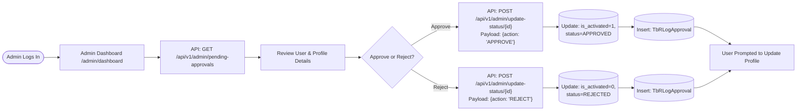
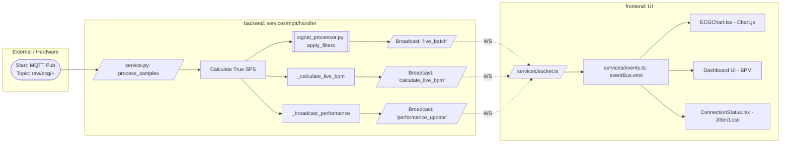
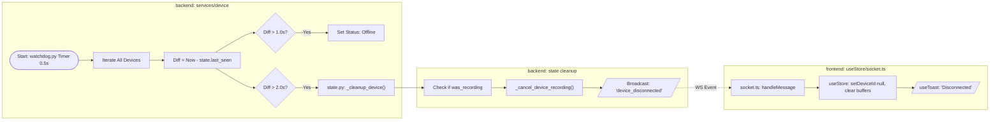
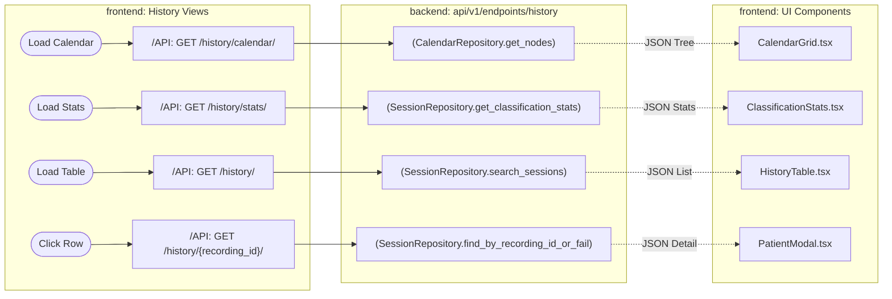
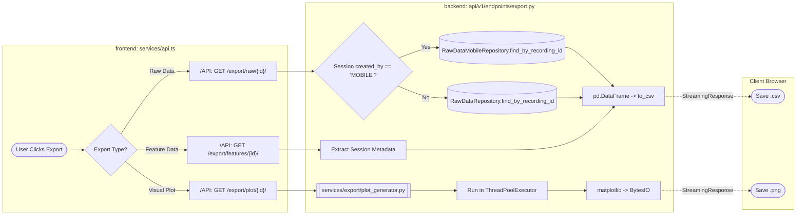
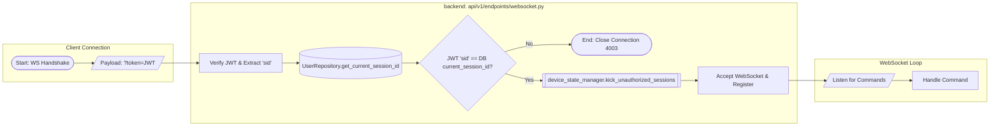

# System Flow Documentation (Technical Swimlanes)

This document maps the architectural flows using standard flowchart notation organized into "Swimlanes" (Subsystems). It reflects the current project structure with distinct role-based dashboards, multi-step onboarding flows, admin approval mechanisms, and continuous ML segmentation loops.

**Notation Legend:**
- `([Start/End])`: Terminal Point (Trigger or End of flow).
- `[Process]`: Internal function call, calculation, or logic execution.
- `[/Input/Output/]`: Data transmission (WebSocket/MQTT) or User Input.
- `{Decision}`: Conditional Logic (If/Else).
- `[(Database)]`: Read/Write to PostgreSQL.
- `[[Subroutine]]`: Complex process defined elsewhere.

---

## 0. Master System Flow (Lifecycle & Governance)
*Comprehensive view: From Registration to Role-Based Monitoring and Analytics.*

```mermaid
flowchart LR
    %% --- REGISTRATION & ONBOARDING ---
    subgraph Onboarding_Lane [Onboarding & Identity]
        Reg([Register User]) --> Login[/Login/]
        Login --> CheckRole{Has Role?}
        CheckRole -- No --> ModSel[Module Selection]
        ModSel --> ECG_Mod[ECG Monitoring]
        ECG_Mod --> RoleSel[Choose Role: Patient/Staff/Doctor]
        RoleSel --> ProfForm[Fill Profile Details]
        ProfForm --> SubQueue[Status: QUEUE]
    end

    %% --- ADMIN GOVERNANCE ---
    subgraph Admin_Lane [Admin Governance]
        SubQueue -.-> PendList[Pending Approvals]
        PendList --> Review{Approve?}
        Review -- Yes --> Approved[Status: APPROVED]
        Review -- No --> Rejected[Status: REJECTED]
    end

    %% --- ACTIVE MONITORING ---
    subgraph Monitoring_Lane [Active Monitoring]
        CheckRole -- Yes --> Dash[Role Dashboard]
        Approved -.-> Dash
        Dash --> SelectDev[Select Device]
        SelectDev --> LiveWatch[Watch Live Stream & BPM]
        LiveWatch --> RecStart[Start Recording]
        RecStart --> SegLoop[[Data Segment Loop]]
        SegLoop --> AI_Res[View AI Results]
    end

    %% --- HISTORY & ARCHIVE ---
    subgraph History_Lane [History & Archive]
        AI_Res -.-> DB_Sess[(Database)]
        DB_Sess -.-> Hist[Calendar & History View]
        Hist --> Export[Export CSV/Plot]
    end
```



---

## 1. Onboarding & Role Assignment
*Flow: Preventing unverified access and enforcing clinical identity before users can access live data.*

```mermaid
flowchart LR
    Start([User Logs In via /login]) --> FetchProf[Fetch Profile Info]
    FetchProf --> CheckRole{Has Assigned Role?}
    CheckRole -- Yes --> Dashboard["Redirect to Specific Role Dashboard\n(e.g., /patient/dashboard)"]
    CheckRole -- No --> ModuleSel[Redirect to /dashboard\nModule Selection]
    
    ModuleSel --> ClickECG[Click 'ECG Monitoring']
    ClickECG --> Onboarding[Redirect to /onboarding\nRole Selection]
    
    Onboarding --> ChooseRole[Select: Patient / Operator / Doctor]
    ChooseRole --> ProfileForm["Fill details in /onboarding/{role}"]
    ProfileForm --> Submit[Submit Profile Data]
    
    Submit --> API_Profile["API: POST /api/v1/auth/profile/{role}"]
    API_Profile --> UpdateDB[(Database: Update TbMUser & Create Profile)]
    UpdateDB --> SetQueue[Set Initial Status: QUEUE]
    SetQueue --> PendingUI[Redirect to Dashboard:\nShow 'Awaiting Approval' State]
```



---

## 2. Admin Approval Workflow
*Flow: Manual verification of clinical staff and patients by Administrators.*



---

## 3. Live Data Ingestion Pipeline
*Flow: From hardware MQTT publication to Frontend Visualization including filtering, live BPM, and network performance calculation.*



---

## 4. Continuous Recording & Segmentation Loop
*Flow: Continuous recording with automatic segment handling. Once a buffer fills, it flushes to the DB, triggers ML inference in the background, and seamlessly starts a new recording UUID for the next segment.*

```mermaid
flowchart LR
    %% SWIMLANE: BACKEND DATA STORAGE
    subgraph Recording_Loop [backend: services/mqtt/handler]
        SampleIn([New Processed Sample]) --> CheckRec{state.is_recording?}
        CheckRec -- Yes --> Buffer[Append to: buffer_recording_batch]
        Buffer --> SendProg[/Broadcast: 'progress_update'//]
        SendProg --> CheckSeg{Samples >= target_buffer_size?}
        
        CheckSeg -- No --> Continue([Wait for next sample])
        CheckSeg -- Yes --> CompleteSeg["_complete_segment()"]
        
        CompleteSeg --> Flush[Flush all buffers to DB]
        Flush --> TrigML["Trigger: ml_engine.trigger_analysis(old_id)"]
        TrigML --> NewSeg[Generate new UUID for next segment]
        NewSeg --> CreateDB[(SessionRepository.create_session)]
        CreateDB --> UpdateState[Update state.recording_id]
        UpdateState --> Continue
    end

    %% SWIMLANE: ML WORKER
    subgraph Analysis [backend: services/analysis]
        TrigML -.->|Async Task| Fetch[(RawDataRepository.get_raw_data)]
        Fetch --> ExtFeature[[feature_extractor.py]]
        ExtFeature --> Model[[ML Model: Classification]]
        Model --> SaveRes[(SessionRepository.update_analysis_results)]
        SaveRes --> BroadRes[/Broadcast: 'live_result'//]
    end

    %% SWIMLANE: FRONTEND
    subgraph UI [frontend: AI Analysis]
        BroadRes -.->|WS| StoreUpdate[useStore: addLiveResult]
        StoreUpdate --> ShowRes[/AIAnalysisCard: Render Classification//]
    end
```



---

## 5. Watchdog & Disconnect Handling (Strict Mode)
*Flow: Real-time detection of lost connection ensuring UI resets and resources are freed.*



---

## 6. History: Archives & Analytics
*Flow: Fetching paginated history data, calendar views, classification stats, and detailed segment analysis.*



---

## 7. Export Data Pipeline
*Flow: Generating downloadable reports (CSV datasets and PNG plots).*



---

## 8. WebSocket: Session Enforcement (Last Login Wins)
*Flow: Preventing multiple concurrent connections for the same account to ensure data integrity and avoid cross-session pollution.*



---

## 9. Authentication & Must-Reset-Password Flow
*Flow: Login API semantics and how `must_reset_password` drives the frontend ChangePassword modal. The backend returns `404` when the email/user is not found, and `401` when credentials are incorrect. If `must_reset_password` is set on the user record, the frontend must surface the ChangePassword modal and the `PUT /api/v1/auth/change-password` endpoint clears the flag server-side on success.*

```mermaid
flowchart LR
    StartLogin([Client POST /api/v1/auth/login]) --> FindUser[(UserRepository.find_by_email)]
    FindUser --> NoUser{Exists?}
    NoUser -- No --> Resp404([HTTP 404: user not found])
    NoUser -- Yes --> CheckPass[Verify password]
    CheckPass -- Fail --> BadPass([HTTP 401: invalid credentials])
    CheckPass -- OK --> AuthOK([Issue JWT + session 'sid'])
    AuthOK --> UserResp[(UserResponse includes must_reset_password)]
    UserResp --> MustReset{must_reset_password == 1?}
    MustReset -- Yes --> ShowModal[Frontend: Show ChangePasswordModal]
    MustReset -- No --> ContinueLogin[Proceed to Dashboard]
    ShowModal --> PutChange[PUT /api/v1/auth/change-password]
    PutChange --> ValidateOld[Optional: validate current password/confirm policy]
    ValidateOld --> UpdatePass[Repository: update password & set must_reset_password = 0]
    UpdatePass --> RespOk([HTTP 200: password updated; must_reset_password cleared])
```



Notes:
- Frontend must treat `404` from `/login` as "user not found" (show signup/forgot-password options); treat `401` as wrong password.
- `must_reset_password` is a field in `UserResponse` returned by auth/profile endpoints and should be respected by `AuthGuard` and the UI.

---

## 10. Walk-in Conversion & Admin Update Semantics
*Flow: Converting a walk-in patient to a full user account and how admin updates handle explicit `NULL` values.*

```mermaid
flowchart LR
    StartConv([Admin: Convert Walk-in -> User]) --> FetchPat[(PatientRepository.find_by_id)]
    FetchPat --> CreateUser[UserRepository.create (optional password)]
    CreateUser --> HasPwd{Password Provided?}
    HasPwd -- Yes --> SetPwd[Hash & store; must_reset_password = 0]
    HasPwd -- No --> NoPwd[Set must_reset_password = 1; send reset email/notification]
    CreateUser --> SetCreatedBy[Set User.created_by = patient.created_by (operator id)]
    SetCreatedBy --> LinkPatient[Update Patient.user_id = new_user.id]
    LinkPatient --> RespOk([HTTP 200: conversion complete; returns new user object])
```

Admin Update NULL semantics:

```mermaid
flowchart LR
    AdminUpdate([Admin: PATCH/PUT /api/v1/admin/user/{id}]) --> PayloadCheck{Field explicitly null?}
    PayloadCheck -- Yes --> PersistNull[(Persist NULL to DB column)]
    PayloadCheck -- No --> Merge[(Merge provided fields; preserve non-provided values)]
```

Notes:
- Converting walk-ins must copy provenance: `user.created_by` should reflect the original operator id who created the walk-in patient record.
- If the convert API call omits a password, the backend sets `must_reset_password=1` so that the user is forced to pick a password on first login.
- Admin update endpoints persist explicit `null` values. If a client intends to clear a field, it should send an explicit `null` value in the PATCH/PUT payload.

```
