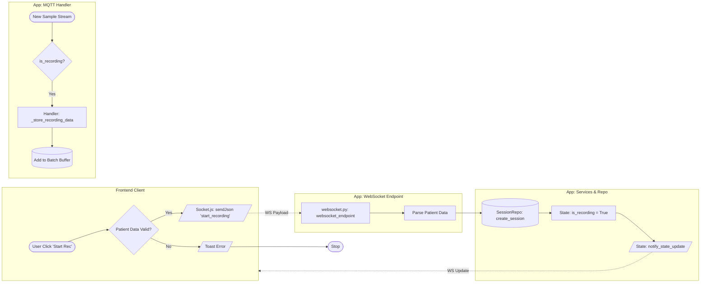
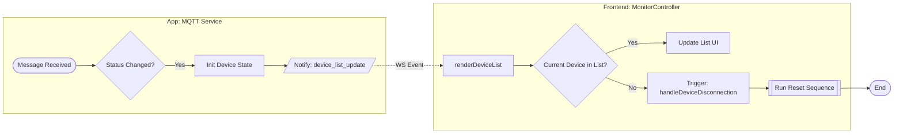

# System Flow Documentation (Technical Swimlanes)

This document maps the architectural flows using standard flowchart notation organized into "Swimlanes" (Subsystems). It reflects the current codebase structure in `E:\KERJAAN\Oneject\Development\ecg-puskesmas\app`.

**Notation Legend:**
- `([Start/End])`: Terminal Point (Trigger or End of flow).
- `[Process]`: internal function call or calculation.
- `[/Input/Output/]`: Data transmission (WebSocket/MQTT) or User Input.
- `{Decision}`: Conditional Logic (If/Else).
- `[(Database)]`: Read/Write to PostgreSQL/Filesystem.
- `[[Subroutine]]`: Complex process defined elsewhere (e.g., ML Inference).

---

## 1. Live Data Ingestion Pipeline
*Flow: From hardware MQTT publication to Frontend Visualization.*

```mermaid
flowchart LR
    %% SWIMLANE: HARDWARE / BROKER
    subgraph External [External / MQTT Broker]
        StartStream([MQTT Pub: raw/ecg/+])
    end

    %% SWIMLANE: BACKEND SERVICE LAYER
    subgraph Backend_MQTT [App: MQTT Service]
        direction TB
        RecvMsg[/Client: _handle_message/]
        Parse[[Protocol: parse_packet]]
        CheckNew{New Device?}
        
        RecvMsg --> Parse
        RecvMsg --> CheckNew
        CheckNew -- Yes --> NotifyList[/Notify List Update/]
        
        Parse --> Process["Handler: process_samples()"]
        Process --> Jitter["Handler: _handle_jitter_buffer()"]
        Jitter --> LiveCalc["Handler: _process_single_sample()"]
    end

    %% SWIMLANE: BACKEND STATE MANAGEMENT
    subgraph Backend_State [App: Device State]
        LiveCalc --> Thrott{Throttle Limit?}
        Thrott -- Pass --> BroadWS[/State: broadcast_to_device/]
        Thrott -- Block --> Drop([Drop Frame])
    end

    %% SWIMLANE: FRONTEND
    subgraph Frontend [Frontend: MonitorController]
        BroadWS -.->|WS: live_data| SocketRx[/Socket.js: onmessage/]
        SocketRx --> EvBus[Events.js: emit 'ecg-data']
        EvBus --> Chart["Charts.js: uPlot.setData()"]
        Chart --> Render([Render Graph])
    end

    StartStream --> RecvMsg
```



---

## 2. Recording Session Control
*Flow: User initiates recording -> System persists data.*



---

## 3. Watchdog & Disconnect Handling (Strict Mode)
*Flow: Real-time detection of lost connection (2.0s timeout).*

```mermaid
flowchart LR
    %% SWIMLANE: BACKGROUND SERVICE
    subgraph Watchdog [App: DeviceWatchdogService]
        Timer([Timer: 0.5s Interval])
        CheckLoop[Iterate All Devices]
        CalcDiff[Diff = Now - LastSeen]
        
        Timer --> CheckLoop --> CalcDiff
        
        IsOffline{Diff > 1.0s?}
        IsDisc{Diff > 2.0s?}
        
        CalcDiff --> IsOffline
        IsOffline -- Yes --> MarkOff[Set Status: Offline]
        
        CalcDiff --> IsDisc
        IsDisc -- Yes --> GetRecState[Get 'was_recording' State]
    end

    %% SWIMLANE: DISCONNECTION LOGIC
    subgraph Cleanup_Logic [App: Cleanup & Notify]
        GetRecState --> Payload[/Construct Payload: {reason, was_recording}/]
        Payload --> Broadcast[/State: broadcast_to_device 'device_disconnected'/]
        Broadcast --> CancelRec["_cancel_device_recording()"]
        CancelRec --> WipeMem["_cleanup_device()"]
    end

    %% SWIMLANE: FRONTEND RESPONSE
    subgraph Frontend_UI [Frontend: MonitorController]
        Broadcast -.->|WS Event| HdlDisc[handleDeviceDisconnection]
        HdlDisc --> ResetUI[selectDevice '' -> Reset Charts/Dropdown]
        
        ResetUI --> CheckFlag{Payload.was_recording?}
        CheckFlag -- Yes --> Alert[/Alert: 'Recording Stopped'/]
        CheckFlag -- No --> Toast[/Toast: 'Disconnected'/]
    end
    
    WipeMem --> EndWD([End Cycle])
```

---

## 4. Device List Synchronization (Implicit Disconnect)
*Flow: Handling race conditions where Watchdog clears device before UI updates.*



---

## 5. ML Analysis & Feedback Loop
*Flow: Post-processing of completed recording segments.*

```mermaid
flowchart LR
    %% SWIMLANE: TRIGGER
    subgraph Handler [App: MQTT Handler]
        SegFull([Segment Full: 1000 samples]) --> Trigger[ml_engine.trigger_analysis]
    end

    %% SWIMLANE: ML WORKER
    subgraph Worker_Thread [App: ML Engine Service]
        Trigger --> Exec[ThreadPoolExecutor]
        Exec --> FetchDB[(RawDataRepo: Fetch)]
        FetchDB --> FeatExt[[feature_extractor.extract]]
        FeatExt --> ModelPred[[Keras Model: predict]]
        ModelPred --> SaveRes[(SessionRepo: Update Result)]
    end

    %% SWIMLANE: FEEDBACK
    subgraph Feedback [App: Broadcast]
        SaveRes --> SendRes[/Broadcast: live_result/]
    end

    %% SWIMLANE: UI
    subgraph UI [Frontend: MonitorController]
        SendRes -.->|WS Event| UpdateCard[updateAICard]
        UpdateCard --> ShowBar[/Animate Confidence Bar/]
    end
```

