# System Flow Documentation (Technical Swimlanes)

This document maps the architectural flows using standard flowchart notation organized into "Swimlanes" (Subsystems). It reflects the refactored project structure with distinct `frontend/` (Next.js) and `backend/` (FastAPI) applications.

**Notation Legend:**
- `([Start/End])`: Terminal Point (Trigger or End of flow).
- `[Process]`: Internal function call, calculation, or logic execution.
- `[/Input/Output/]`: Data transmission (WebSocket/MQTT) or User Input.
- `{Decision}`: Conditional Logic (If/Else).
- `[(Database)]`: Read/Write to PostgreSQL.
- `[[Subroutine]]`: Complex process defined elsewhere.

---

## 1. Live Data Ingestion Pipeline
*Flow: From hardware MQTT publication to Frontend Visualization.*

```mermaid
flowchart LR
    %% SWIMLANE: HARDWARE
    subgraph External [External / Hardware]
        StartStream([Start: MQTT Pub])
    end

    %% SWIMLANE: BACKEND SERVICE
    subgraph Backend_Service [backend: services/mqtt]
        direction TB
        RecvMsg[/handler.py: _handle_message/]
        Parse[[protocol.py: parse_packet]]
        CheckNew{New Device?}
        
        RecvMsg --> CheckNew
        CheckNew -- Yes --> NotifyList[/Notify List Update/]
        CheckNew -- No --> Parse
        
        Parse --> Process["handler.py: process_samples()"]
        Process --> Jitter["handler.py: _handle_jitter_buffer()"]
        Jitter --> LiveCalc["handler.py: _process_single_sample()"]
    end

    %% SWIMLANE: BACKEND STATE
    subgraph Backend_State [backend: services/device]
        LiveCalc --> Thrott{Throttle Limit?}
        Thrott -- Pass --> BroadWS[/state.py: broadcast_to_device/]
        Thrott -- Block --> Drop([End: Drop Frame])
    end

    %% SWIMLANE: FRONTEND
    subgraph Frontend [frontend: UI]
        direction TB
        BroadWS -.->|WS: live_data| SocketRx[/services/socket.ts: onmessage/]
        SocketRx --> EvBus[services/events.ts: globalEventBus emit 'chart:ecg_data']
        EvBus --> Chart["components/monitor/ECGChart.tsx: Chart.js update"]
        Chart --> Render([End: Render Graph])
    end

    StartStream --> RecvMsg
```

---

## 2. Recording Session Control
*Flow: Split into (A) The Command to Start and (B) The Data Storage Loop.*

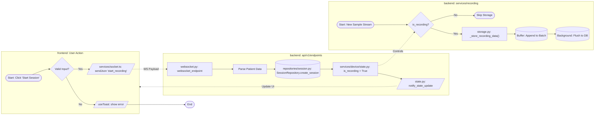

---

## 3. Watchdog & Disconnect Handling (Strict Mode)
*Flow: Real-time detection of lost connection (2.0s timeout).*

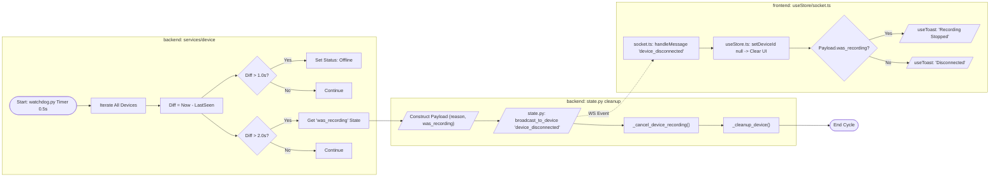

---

## 4. Device List Synchronization (Implicit Disconnect)
*Flow: Handling race conditions where Watchdog clears device before UI updates.*

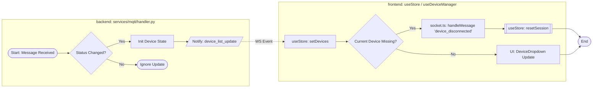

---

## 5. ML Analysis & Feedback Loop
*Flow: Post-processing of completed recording segments.*

```mermaid
flowchart LR
    %% SWIMLANE: TRIGGER
    subgraph Handler [backend: services/mqtt/handler.py]
        SampleCount([Start: 1000 samples collected]) --> SegComp["_complete_segment()"]
        SegComp --> TrigML["services/analysis/ml_engine.py: trigger_analysis()"]
    end

    %% SWIMLANE: ML WORKER
    subgraph Worker_Thread [backend: services/analysis]
        direction TB
        TrigML --> ThreadPool[Run in ThreadPool]
        ThreadPool --> FetchDB[(repositories/session.py: RawDataRepository.get_raw_data)]
        FetchDB --> FeatExt[[feature_extractor.py: extract]]
        FeatExt --> ModelPred[[Keras Model: predict]]
        ModelPred --> SaveRes[(repositories/session.py: SessionRepository.update_analysis_results)]
    end

    %% SWIMLANE: FEEDBACK
    subgraph Feedback [backend: state.py]
        SaveRes --> SendRes[/Broadcast: live_result/]
    end

    %% SWIMLANE: UI
    subgraph UI [frontend: AIAnalysisCard.tsx]
        SendRes -.->|WS Event| UpdateStore[useStore: addLiveResult]
        UpdateStore --> ShowUI[AIAnalysisCard: Render Classification]
        ShowUI --> ShowBar[/Animate Confidence Bar/]
        ShowBar --> EndML([End])
    end
```

---

## 6. Authentication: Login Flow
*Flow: User authentication and JWT Token generation.*

```mermaid
flowchart LR
    %% SWIMLANE: FRONTEND
    subgraph UI [frontend: /login/page.tsx]
        UserLogin([Start: Click Login]) --> Payload[/Input: Email/Pass/]
        Payload --> ReqPost[/API: POST /api/v1/auth/login/]
    end

    %% SWIMLANE: BACKEND API
    subgraph API [backend: api/v1/endpoints/auth.py]
        ReqPost -.->|HTTP Request| Route["auth.py: login"]
        Route --> AuthSvc["core/security.py: authenticate_user"]
        AuthSvc --> DBQuery[(repositories/user.py: UserRepository.get_by_email)]
        
        DBQuery --> Verify{Password Valid?}
        Verify -- No --> Err401([End: Return 401])
        Verify -- Yes --> CreateTok["core/security.py: create_access_token"]
    end

    %% SWIMLANE: RESPONSE
    subgraph Response [frontend: Handling]
        CreateTok --> Ret200[/Return: access_token/]
        Ret200 -.->|JSON| SaveTok["localStorage.setItem('ecg_token')"]
        SaveTok --> Redir([End: Redirect /monitor])
        Err401 -.-> ShowErr[/useToast: show error/]
    end
```

---

## 7. Authentication: Registration Flow
*Flow: New user signup and database insertion.*

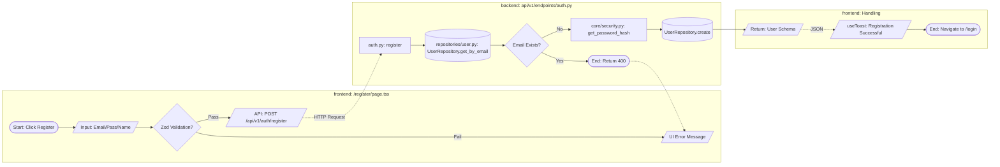

---

## 8. History: Archive Retrieval
*Flow: Fetching paginated history data.*

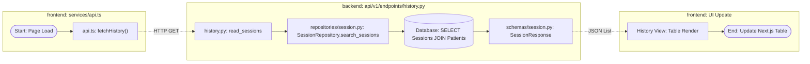

---

## 9. History: Detail View & Charts
*Flow: Viewing deep analytics for a specific session.*

```mermaid
flowchart LR
    %% SWIMLANE: FRONTEND
    subgraph UI [frontend: components/shared/PatientModal.tsx]
        ClickRow([Start: Click Table Row]) --> ReqDet["api.ts: fetchSessionDetails()"]
    end

    %% SWIMLANE: BACKEND
    subgraph API [backend: api/v1/endpoints/history.py]
        ReqDet -.->|HTTP GET| Endpoint["history.py: read_session"]
        Endpoint --> FetchSess[(SessionRepository.get_by_recording_id)]
        FetchSess --> FetchRaw[(RawDataRepository.get_by_session)]
        FetchRaw --> Combine[Combine Session + Analysis + Raw]
    end

    %% SWIMLANE: RENDER
    subgraph Frontend_Modal [frontend: PatientModal]
        Combine -.->|JSON Detail| OpenMod["PatientModal: Render Props"]
        OpenMod --> RenderChart["ECGChart: Render Static Segment"]
        RenderChart --> View([End: View Details])
    end
```

---

## 10. Export Data (CSV & Plot)
*Flow: Generating and downloading reports.*

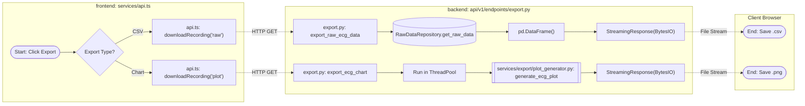

---

## 11. Performance Monitoring (Per Device)
*Flow: Calculating and broadcasting network metrics.*

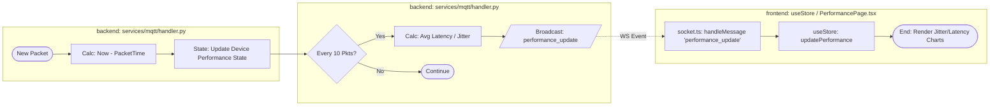
