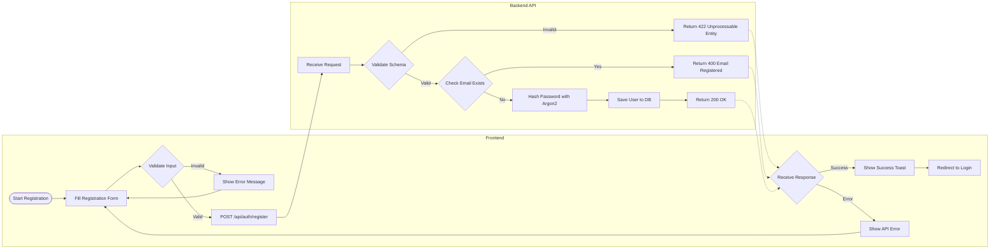
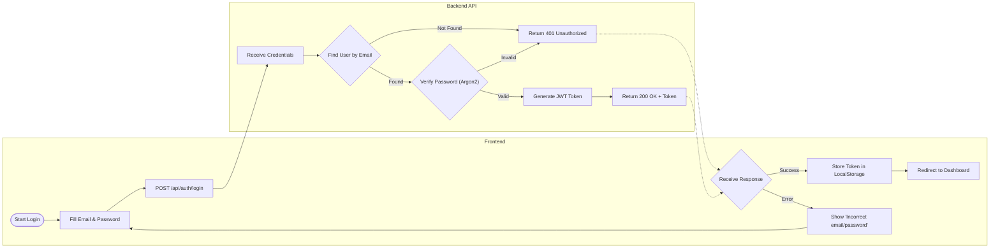
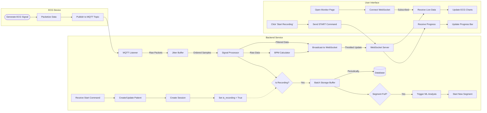
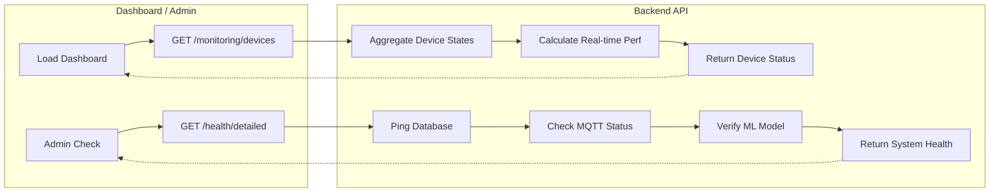

# System Flow Diagrams

This document outlines the core functional flows of the ECG Live Platform, including authentication, real-time monitoring, recording, data processing, and historical review.

## 1. Authentication Flow

This section details the Registration and Login processes.

### Registration Process



### Login Process



---

## 2. Live Monitoring & Recording Flow

This flow describes how ECG data moves from the hardware device to the user's screen and how recording sessions are managed.



---

## 3. History & Analysis Review Flow

This flow illustrates how users retrieve past recordings and view analysis results.

```mermaid
flowchart LR
    subgraph Frontend [User Interface]
        NavHist[Navigate to History] --> FillFilter[Set Filters (Date, Patient)]
        FillFilter --> ReqList[GET /api/history]
        
        RecvList[Render List] --> ClickItem[Select Recording]
        ClickItem --> ReqDetail[GET /api/history/{id}]
        
        RecvDetail[Render Detail] --> ViewRes[View Classification & Metrics]
    end

    subgraph Backend [Backend API]
        ReqList --> SearchRepo[SessionRepo.search_sessions]
        SearchRepo --> QueryDB[(Database)]
        QueryDB -->|Results| SearchRepo
        SearchRepo --> RetList[Return Session List]
        
        ReqDetail --> GetRepo[SessionRepo.get_by_id]
        GetRepo --> QueryDBDetail[(Database)]
        QueryDBDetail -->|Session + Patient| GetRepo
        GetRepo --> RetDetail[Return Session Details]
    end
    
    RetList -.-> RecvList
    RetDetail -.-> RecvDetail
```

---

## 4. Data Analysis Pipeline (ML)

Triggered automatically when a recording segment completes.

```mermaid
flowchart LR
    subgraph Service [Analysis Service]
        Trigger([Segment Complete]) --> FetchData[Fetch Recording Data]
        FetchData --> FeatExt[Feature Extraction]
        FeatExt -->|RR, PR, QT Intervals| MLModel[ML Model (ANN)]
        
        MLModel -->|Classify| Result{Abnormal?}
        Result -->|Yes/No| SaveRes[Save Classification]
        
        FeatExt --> SaveMetrics[Save Interval Metrics]
        
        SaveRes --> UpdateDB[(Database)]
        SaveMetrics --> UpdateDB
    end
```

---

## 5. Export & Reporting Flow

Processes for downloading data and generating reports.

```mermaid
flowchart LR
    subgraph Frontend [User Interface]
        ClickExpRaw[Click 'Export CSV'] --> ReqRaw[GET /export/raw/{id}]
        ClickExpChart[Click 'Export Chart'] --> ReqChart[GET /export/plot/{id}]
        ClickExpFeat[Click 'Export Features'] --> ReqFeat[GET /export/features/{id}]
    end

    subgraph Backend [Backend API]
        ReqRaw --> FetchRaw[Fetch Raw Data]
        FetchRaw --> GenCSV[Generate CSV]
        GenCSV --> StreamRaw[Stream File]
        
        ReqChart --> GenPlot[Generate Plot (Thread Pool)]
        GenPlot --> DrawWave[Draw Waveforms]
        DrawWave --> StreamImg[Stream PNG]
        
        ReqFeat --> FetchFeat[Fetch Features]
        FetchFeat --> GenFeatCSV[Generate CSV]
        GenFeatCSV --> StreamFeat[Stream File]
    end
    
    StreamRaw -.-> ClickExpRaw
    StreamImg -.-> ClickExpChart
    StreamFeat -.-> ClickExpFeat
```

---

## 6. System Health & Monitoring Flow

Continuous monitoring of system status and performance.

