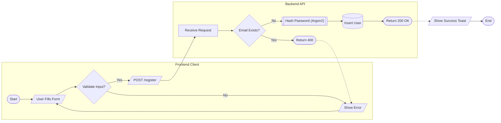
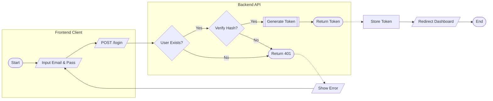
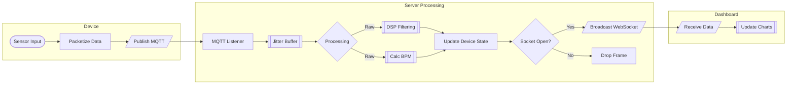
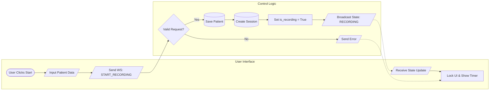
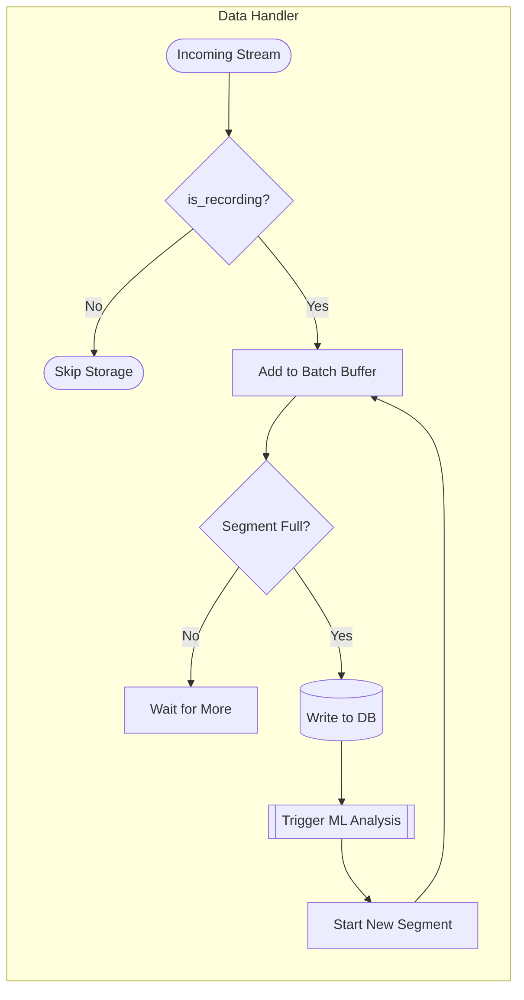
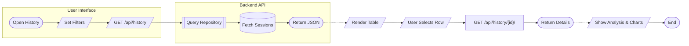
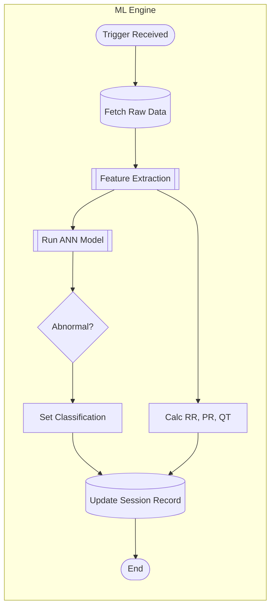
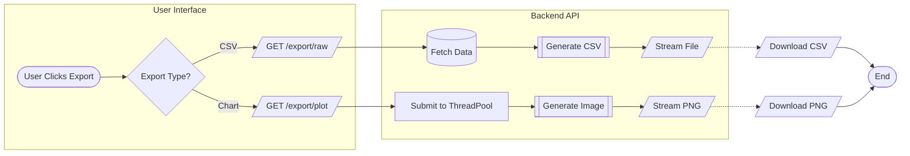
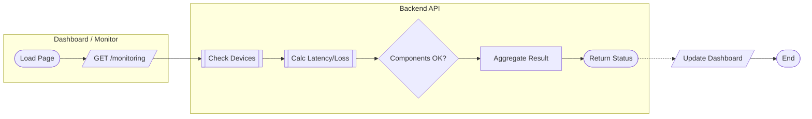

# System Flow Diagrams

This document outlines the core functional flows of the ECG Live Platform.

**Legend:**
- `([Start/End])`: Terminal points.
- `[Process]`: Action or processing step.
- `[/Input/Output/]`: Data I/O or User Interaction.
- `{Decision}`: Conditional logic.
- `[(Database)]`: Data storage.
- `[[Sub-process]]`: Reference to another defined process.

---

## 1. Authentication Flow

### 1.1 Registration Process

### 1.2 Login Process

---

## 2. Live Monitoring System

To reduce complexity, this system is split into **Data Streaming** (automatic) and **Recording Control** (manual).

### 2.1 Live Data Pipeline (Streaming)
*Flow of ECG signal data from hardware to screen.*

### 2.2 Recording Control Logic
*User interaction to Start/Stop recording sessions.*

### 2.3 Recording Data Storage (Background)
*How data is saved when `is_recording = True`.*

---

## 3. History & Analysis Review Flow

---

## 4. Data Analysis Pipeline (ML)

*Asynchronous process triggered by Segment Completion.*

---

## 5. Export & Reporting Flow

---

## 6. System Health & Monitoring Flow

